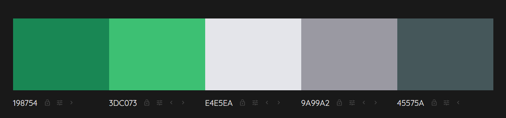
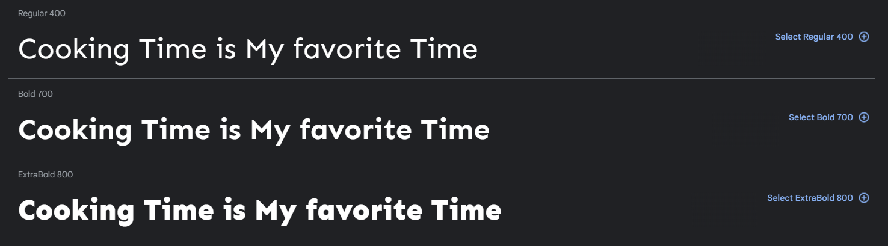

# Portfolio Project 4 - Full-Stack Toolkit


# Cooking Time is My favorite Time ♡
## Inspiring yet simple food recipes for delicious, everyday cooking.
Finding the right recipe is more difficult than ever. That's why we've made it simple.

Shemmylicious Food is a food recipe blog designed to allow the User to find and review recipes as well as join a community of like-minded people gathered around a passion for food and interested in exchanging their ideas and views on food.

## This is how easy it works!
1. Simply register, log in and create profile to join the Shemmylicious food-loving community.
2. Create or browse recipes, find the one you're inspired by and prepare Shemmylicious food.
3. Share your passion for food, comment and like Shemmylicious food blog...

The site features a search function that allows the User to search the db of recipes. 
Users can add recipes, like and comment on the newest recipes as well as view them by category and get in touch with other users. Users (after logging in) will be able to view Recipe details such as ingredients required, instructions, and other information (i.e: nutrition facts etc.) as well as comment and like recipes. 

Users will also be able to create and view customizable Profile pages, where they will be able to enter information about themselves, upload their profile picture as well as share other social media.

You can view the live, deployed to Heroku application here: <a href ='https://shemmylicious.herokuapp.com/' target="_blank">Shemmylicious Food</a>


## __Live Web-Page__
[Shemmylicious Food](https://shemmylicious.herokuapp.com/)

## __GitHub Repository__
[https://github.com/ShemmyYo/django-shemmylicious](https://github.com/ShemmyYo/django-shemmylicious)

## __Tech Stack__

               

***

# Contents

- [Overview](#shemmylicious-logo)
- [Project Goal](#project-goal)
- [UX User Experience](#ux-user-experiance)
    - [Design](#design)
        - [Colour Scheme](#colour-scheme)
        - [Typography](#typography)
        - [Imagery](#imaginary)
            - [Logo design](#logo-design-with-figma)
            - [Favicon](#icons-with-favicon)
    - [Wireframes](#wireframes)
    - [Agile](#agile)
        - [The Ideal User/Persona](#the-ideal-user)
        - [Epics](#epics)
        - [User Stories](#user-stories)
- [Features](#features)
    - [Existing Features](#existing-features)
        - []()

    - [Future Features]()
- [Technologies Used](#technologies-used)
    - [Tools & technologies used]()
    - [Imported Libraries and Packages](#libraries-imported)
    - [Data Model](#data-model)
    - [Development Process]
        - [GitHub Projects]
        - [GitHub Issued]
- [Testing](#testing)
    - [Validation]
        - [HTML]
        - [CSS]
        - [Lighthouse]
        - [PEP8 CI Validation](#pep8-ci-validation)
    - [Tests based on user stories](#tests-based-on-user-stories)
    - [Manual tests](#manual-tests)
    - 
    - [Bugs](#bugs)
    - [Browser Compatibility](#browser-compatibility)
- [Deployment](#deployment)
    - [ElephantSQL]
    - [Cloudinary API]
    - [Deploy to Heroku](#deploy-to-heroku)
    - [Local Deployment](#local-deployment)
    - [To Fork the Repository](#to-fork-the-repository)
- [Credits](#credits)
    - [Code](#code)
    - [Design](#design)
    - [Media]
    - [Acknowledgements](#acknowledgements)

***

# Project Goal

The project goal was to build a Full-Stack site based on business logic and create user friendly, commerially focused project that uses HTML, CSS, JavaScript, Python+Django as well as centrally-owned dataset (ElephantSQL relational database).

In this project I will present my ability to:

- use Agile methodologies (agile tool - Github projects) to track the tasks involved in creating the project relating to identified user stories.

- implement front-end CRUD (Create Read Update Delete) functionality, including front-end UI that allows users to Create, Read, Update, and Delete records in the database, without having to access the admin panel.

- set up an authentication mechanism and provide role-based access to the site's data or other activities based on the dataset.

***

# UX User Experiance

## Design

### Colour Scheme
***
I opted for a very minimalistic aesthetic and only apllied 3 colours (2 with additional shades) to this project.

```css
root {
    --background-col: #45575A;
    --light-gray-col: #9A99A2;
    --light-col: #E4E5EA;
    --accent-col: #3DC073;
    --basic-col: #198754;
}
```

To provide a better user experience, I went for a bright theme with an hints of green to add spice to the site. 
The colours have been implemented across the site and are included in the buttons/links and their hover effects.

I used  [Colormind](http://colormind.io/) colour scheme for this project:




### Typography
***
The two fonts used were imported into the CSS from [Google Fonts](https://fonts.google.com/)
[Font Awesome](https://fontawesome.com) icons were used throughout the site, such as the social media icons in the footer.

I used 'Sen' for logo, menues and all headings.




'Lucida Sans' has been used as a additional font for paragraphs any other text.
'Sans-serif' is the nominated fallback font.

```CSS 
root {
    --main-font: 'Sen', sans-serif;
    --additional-font: 'Lucida Sans', 'Lucida Sans Regular', 'Lucida Grande', 'Lucida Sans Unicode', Geneva, Verdana, sans-serif;
}
```

### Imaginary
***

I designed a Shemmylicious logo with  [Figma](https://www.figma.com/)

same logo has then been used to create [Favicon](https://favicon.io/) icons.


***
## Agile 

### The Ideal User/Persona

Food blog users are passionate about all things culinary and seek to expand their knowledge and skills in the kitchen, while also enjoying the social aspects of sharing their experiences with others.

**Who**: This persona is passionate about food and enjoys exploring new flavors and cuisines. They are likely to prioritize taste over convenience or health benefits. Marketing messages that emphasize the unique and delicious flavors of your products, as well as the high quality ingredients, will appeal to this persona.
A women aged 25 to 34 are our biggest recipe-browsing demographic group. But that's followed closely by women, ages 55 to 64.

**What**: A food blog user is typically someone who is interested in cooking, eating, and exploring different types of cuisine. They may be a beginner cook looking for recipe inspiration, or a more experienced cook looking to expand their knowledge and skills in the kitchen. 

**Why**: Some common characteristics of a food-blog user include:

- Food Enthusiast: They have a passion for food and enjoy trying new recipes and ingredients.
- Health Conscious: They may be interested in healthy eating and look for recipes that are nutritious and balanced.
- Adventurous: They enjoy trying new things and experimenting with different flavors and cuisines.
- Time-Conscious: They may be looking for recipes that are quick and easy to prepare, or that can be made ahead of time for convenience.
- Social: They may enjoy sharing their own food experiences with others, and may be active on social media platforms related to food and cooking.
- Budget-Conscious: They may be looking for recipes that are affordable and that use ingredients that are readily available.
- Knowledge-Seeking: They may be interested in learning more about different types of cuisine, cooking techniques, and food history.
- Community-Oriented: They may be interested in connecting with other food enthusiasts and bloggers, and may participate in online forums or groups related to food and cooking.

***
### Epics

Epics (milestones) were created which were then further developed into User Stories. 

TBC


***
### User Stories

__New Site Users__

- As a new site user, I would like to ____________, so that I can ____________.
- As a new site user, I would like to ____________, so that I can ____________.
- As a new site user, I would like to ____________, so that I can ____________.
- As a new site user, I would like to ____________, so that I can ____________.
- As a new site user, I would like to ____________, so that I can ____________.


__Returning Site Users__

- As a returning site user, I would like to ____________, so that I can ____________.
- As a returning site user, I would like to ____________, so that I can ____________.
- As a returning site user, I would like to ____________, so that I can ____________.
- As a returning site user, I would like to ____________, so that I can ____________.
- As a returning site user, I would like to ____________, so that I can ____________.


__Site Admin__

- As a site administrator, I should be able to ____________, so that I can ____________.
- As a site administrator, I should be able to ____________, so that I can ____________.
- As a site administrator, I should be able to ____________, so that I can ____________.
- As a site administrator, I should be able to ____________, so that I can ____________.
- As a site administrator, I should be able to ____________, so that I can ____________.

***
### MoSCoW Prioritization

This project was developed using agile methodologies by delivering small features (User Stories) across the project.

The Kanban board was created using Github projects and can be located [here](https://github.com/users/ShemmyYo/projects/5/views/1) and can be viewed to see more information on the project cards. 

Using this approach, I was able to apply the MoSCow prioritization and label user stories.
User Stories were assigned to Epics, prioritized under the labels:

- `MUST HAVE` - guaranteed to be delivered (*max 60% of stories*)
- `SHOULD HAVE` - adds significant value, but not vital (*the rest ~20% of stories*)
- `COULD HAVE` - has small impact if left out (*20% of stories*)
- `WON'T HAVE` - not a priority for this iteration

To ensure that all core requirements were completed I worked on the 'MUST HAVE' epics/user stories first.

A few `COULD HAVE` user stories have been implemented before project due date i.e. ...


***
## Wireframes
***


<details><summary>Desktop</summary>


</details>

[Back to top](#contents)


## Tools & technologies used

### Languages Used

- [HTML5](https://html.spec.whatwg.org/) used for page content and structure 
- [CSS](https://www.w3.org/Style/CSS/Overview.en.html) used for page styling
- [Javascript](https://www.javascript.com/) used for dynamically updated content
- [Python](https://www.python.org/) - used for the functionality of the program

### Frameworks & Tools

- [Django](https://www.djangoproject.com/) used as main python framework
- [Bootstrap](https://blog.getbootstrap.com/) used for page layout and spacing
- [PostgreSQL](https://www.postgresql.org) used for database management
- [ElephantSQL](https://www.elephantsql.com/) used for production database
- [Cloudinary](https://cloudinary.com/) used to store static files and images
- [Heroku](https://dashboard.heroku.com/apps) used to deploy application
- [Gitpod](https://www.gitpod.io/) used to create and host the website
- [Github](https://github.com/) used to deploy the website 
- [Balsamiq](https://balsamiq.com/) used to create page wireframes
- [Stackoverflow](https://stackoverflow.com/) used to troubleshoot code issues
- [CI Python Linter](https://pep8ci.herokuapp.com/) used as Python code validator
- [Chrome Dev Tools](https://developer.chrome.com/docs/devtools/)
- [MindManager](https://app.mindmanager.com/) - for Flowcharts
- [Grammarly](https://www.grammarly.com/) used to check typography
- []() used to generate the Database diagram
- [Technisini](https://techsini.com/multi-mockup/index.php) mockup image of the home page on various devices 

### Imported Libraries and Packages

- [gunicorn]() - Python WSGI HTTP Server for UNIX
- [psycopg2]() - PostgreSQL database adapter for Python
- [cloudinary]() - Python package allowing integration between the application and Cloudinary
- [dj-database-url]() - Django utility to utilise the DATABASE_URL environment variable to configure the Django application. Used with PostgreSQL
- [dj3-cloudinary-storage]() - Django package that facilitates integration with Cloudinary storage
- [Django]() - Python package for the Django framework
- [django-allauth]() - Django user authentication, registration and account management
- [django-crispy-forms]() - - Django package that provides tags and filters to control the rendering behaviour of Django forms
- [django-richtextfield]() - - Model field for rich text editing


### Data Model
### Development Process
 - GitHub Projects
 - GitHub Issued


[Summernote Web](https://summernote.org/)

[Summernote Git](https://github.com/summernote/django-summernote)

[Cloudinary](cloudinary.com)


- [x] Write the press release :joy:
- [ ] Update the website ~~The world is flat.~~
- [ ] Contact the media

term
: definition
> blockquote
*italicized text*


## Testing

For all testing, please refer to the [TESTING.md](TESTING.md) file.


***

### __Browser Compatibility__

After publishing to Heroku, the site was tested on Google Chrome, Microsoft Edge, Safari and Mozilla Firefox, with no visible issues for the user. 
The site has loaded perfectly and had no issues across all browsers.

[Back to Content](<#contents>)

***


## Data Model
***

500 Page

As a Developer I can implement a 500 error page so that I can alert users when an internal server error occurs

A 500 error page has been displayed to alert users when an internal server error occurs. The message relays to users that the problem is on our end, not theirs.


Technologies


Reddit style news site
External user’s goal:

Users want to post, read and comment on news stories.
Site owner's goal:

The site owner would like to create a discussion community.
Potential features to include:

Posts can be up/downvoted
Comments can be left on a post
Time/Date of posting
Topic groupings/categories


Learning Outcomes
LO1	Use an Agile methodology to plan and design a Full-Stack Web application using an MVC framework and related contemporary technologies.
LO2	Implement a data model, application features and business logic to manage, query and manipulate data to meet given needs in a particular real-world domain.
LO3	Identify and apply authorisation, authentication and permission features in a Full-Stack web application solution.
LO4	Create manual and/or automated tests for a Full-Stack Web application using an MVC framework and related contemporary technologies
LO5	Use a distributed version control system and a repository hosting service to document, develop and maintain a Full-Stack Web application using an MVC framework and related contemporary technologies.
LO6	Deploy a Full-Stack Web application using an MVC framework and related contemporary technologies to a cloud-based platform
LO7	Understand and use object-based software concepts


[__Setting up basic Django Project and Deploying to Heroku__](https://docs.google.com/document/d/1P5CWvS5cYalkQOLeQiijpSViDPogtKM7ZGyqK-yehhQ/edit)

Install librieries:
pip3 install 'django<4' gunicorn
pip3 install dj_database_url==0.5.0 psycopg2
pip3 install dj3-cloudinary-storage

Create requirements.txt
pip3 freeze --local > requirements.txt

START NEW PROJECT 
django-admin startproject PROJECT_NAME .


## Deployment

The live deployed application can be found deployed on [Heroku](https://tribe.herokuapp.com).

### ElephantSQL Database

This project uses [ElephantSQL](https://www.elephantsql.com) for the PostgreSQL Database.

To obtain your own Postgres Database, sign-up with your GitHub account, then follow these steps:
- Click **Create New Instance** to start a new database.
- Provide a name (this is commonly the name of the project: tribe).
- Select the **Tiny Turtle (Free)** plan.
- You can leave the **Tags** blank.
- Select the **Region** and **Data Center** closest to you.
- Once created, click on the new database name, where you can view the database URL and Password.

### Cloudinary API

This project uses the [Cloudinary API](https://cloudinary.com) to store media assets online, due to the fact that Heroku doesn't persist this type of data.

To obtain your own Cloudinary API key, create an account and log in.
- For *Primary interest*, you can choose *Programmable Media for image and video API*.
- Optional: *edit your assigned cloud name to something more memorable*.
- On your Cloudinary Dashboard, you can copy your **API Environment Variable**.
- Be sure to remove the `CLOUDINARY_URL=` as part of the API **value**; this is the **key**.

### Heroku Deployment

This project uses [Heroku](https://www.heroku.com), a platform as a service (PaaS) that enables developers to build, run, and operate applications entirely in the cloud.

Deployment steps are as follows, after account setup:

- Select **New** in the top-right corner of your Heroku Dashboard, and select **Create new app** from the dropdown menu.
- Your app name must be unique, and then choose a region closest to you (EU or USA), and finally, select **Create App**.
- From the new app **Settings**, click **Reveal Config Vars**, and set your environment variables.

| Key | Value |
| --- | --- |
| `CLOUDINARY_URL` | insert your own Cloudinary API key here |
| `DATABASE_URL` | insert your own ElephantSQL database URL here |
| `DISABLE_COLLECTSTATIC` | 1 (*this is temporary, and can be removed for the final deployment*) |
| `SECRET_KEY` | this can be any random secret key |

Heroku needs two additional files in order to deploy properly.
- requirements.txt
- Procfile

You can install this project's **requirements** (where applicable) using:
- `pip3 install -r requirements.txt`

If you have your own packages that have been installed, then the requirements file needs updated using:
- `pip3 freeze --local > requirements.txt`

The **Procfile** can be created with the following command:
- `echo web: gunicorn app_name.wsgi > Procfile`
- *replace **app_name** with the name of your primary Django app name; the folder where settings.py is located*

For Heroku deployment, follow these steps to connect your own GitHub repository to the newly created app:

Either:
- Select **Automatic Deployment** from the Heroku app.

Or:
- In the Terminal/CLI, connect to Heroku using this command: `heroku login -i`
- Set the remote for Heroku: `heroku git:remote -a app_name` (replace *app_name* with your app name)
- After performing the standard Git `add`, `commit`, and `push` to GitHub, you can now type:
	- `git push heroku main`

The project should now be connected and deployed to Heroku!

### Local Deployment

This project can be cloned or forked in order to make a local copy on your own system.

For either method, you will need to install any applicable packages found within the *requirements.txt* file.
- `pip3 install -r requirements.txt`.

You will need to create a new file called `env.py` at the root-level,
and include the same environment variables listed above from the Heroku deployment steps.

Sample `env.py` file:

```python
import os

os.environ.setdefault("CLOUDINARY_URL", "insert your own Cloudinary API key here")
os.environ.setdefault("DATABASE_URL", "insert your own ElephantSQL database URL here")
os.environ.setdefault("SECRET_KEY", "this can be any random secret key")

# local environment only (do not include these in production/deployment!)
os.environ.setdefault("DEBUG", "True")
```

Once the project is cloned or forked, in order to run it locally, you'll need to follow these steps:
- Start the Django app: `python3 manage.py runserver`
- Stop the app once it's loaded: `CTRL+C` or `⌘+C` (Mac)
- Make any necessary migrations: `python3 manage.py makemigrations`
- Migrate the data to the database: `python3 manage.py migrate`
- Create a superuser: `python3 manage.py createsuperuser`
- Load fixtures (if applicable): `python3 manage.py loaddata file-name.json` (repeat for each file)
- Everything should be ready now, so run the Django app again: `python3 manage.py runserver`

#### Cloning

You can clone the repository by following these steps:

1. Go to the [GitHub repository](https://github.com/adamgilroy22/tribe) 
2. Locate the Code button above the list of files and click it 
3. Select if you prefer to clone using HTTPS, SSH, or GitHub CLI and click the copy button to copy the URL to your clipboard
4. Open Git Bash or Terminal
5. Change the current working directory to the one where you want the cloned directory
6. In your IDE Terminal, type the following command to clone my repository:
	- `git clone https://github.com/adamgilroy22/tribe.git`
7. Press Enter to create your local clone.

Alternatively, if using Gitpod, you can click below to create your own workspace using this repository.

[](https://gitpod.io/#https://github.com/adamgilroy22/tribe)

Please note that in order to directly open the project in Gitpod, you need to have the browser extension installed.
A tutorial on how to do that can be found [here](https://www.gitpod.io/docs/configure/user-settings/browser-extension).

#### Forking

By forking the GitHub Repository, we make a copy of the original repository on our GitHub account to view and/or make changes without affecting the original owner's repository.
You can fork this repository by using the following steps:

1. Log in to GitHub and locate the [GitHub Repository](https://github.com/adamgilroy22/tribe)
2. At the top of the Repository (not top of page) just above the "Settings" Button on the menu, locate the "Fork" Button.
3. Once clicked, you should now have a copy of the original repository in your own GitHub account!

## Credits

### Content