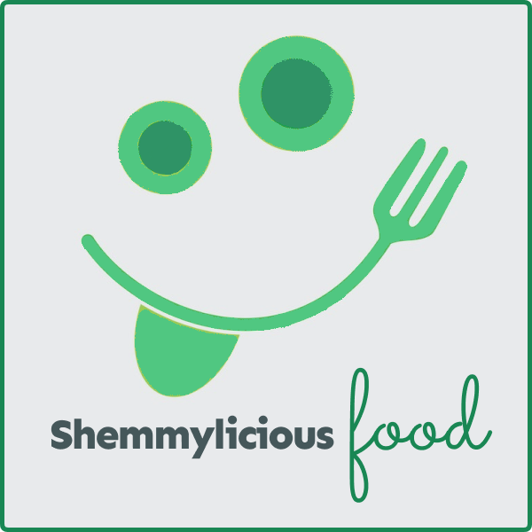

# Portfolio Project 4 - Full-Stack Toolkit


# Cooking Time is My favorite Time ♡
## Inspiring yet simple food recipes for delicious, everyday cooking.
Finding the right recipe is more difficult than ever. That's why we've made it simple.

Shemmylicious Food is a food recipe blog designed to allow the User to find and review recipes as well as join a community of like-minded people gathered around a passion for food and interested in exchanging their ideas and views on food.

## This is how easy it works!
1. Simply register, log in and create profile to join the Shemmylicious food-loving community.
2. Create or browse recipes, find the one you're inspired by and prepare Shemmylicious food.
3. Share your passion for food, comment and like Shemmylicious food blog...

The site features a search function that allows the User to search the db of recipes. 
Users can add recipes, like and comment on the newest recipes as well as view them by category and get in touch with other users. Users (after logging in) will be able to view Recipe details such as ingredients required, instructions, and other information (i.e: nutrition facts etc.) as well as comment and like recipes. 

Users will also be able to create and view customizable Profile pages, where they will be able to enter information about themselves, upload their profile picture as well as share other social media.

You can view the live, deployed to Heroku application here: <a href ='https://shemmylicious.herokuapp.com/' target="_blank">Shemmylicious Food</a>


## __Live Web-Page__
[Shemmylicious Food](https://shemmylicious.herokuapp.com/)

## __GitHub Repository__
[https://github.com/ShemmyYo/django-shemmylicious](https://github.com/ShemmyYo/django-shemmylicious)

## __Tech Stack__

 
 
 
 
 
 
 
 

***

# Contents

- [Overview](#shemmylicious-logo)
- [Project Goal](#project-goal)
- [UX User Experience](#ux-user-experience)
    - [Design](#future-features)
        - [Colour Scheme](#colour-scheme)
        - [Typography](#typography)
        - [Imagery](#Imagery)
            - [Logo design]
            - [Favicon]
    - [Wireframes](#wireframes)
    - [Agile](#agile)
        - [The Ideal User/Persona](#the-ideal-user)
        - [Epics](#epics)
        - [User Stories](#user-stories)
- [Features](#features)
    - [Existing Features](#existing-features)
        - [Player Info](#player-info)
        - [Main Menu](#main-menu)
        - [Instructions](#home)
        - [High-Scores](#highscores)
        - [Deposit Change Option](#deposit)
        - [Setting lines to bet on and bet mount (difficulty level)](#difficulty)
        - [Turn results](#turn-results)
        - [Game Over](#game-over)
    - [Future Features]
- [Technologies Used](#technologies-used)
    - [Tools & technologies used]
    - [Imported Libraries and Packages](#libraries-imported)
    - [Data Model](#data-model)
    - [Development Process]
        - [GitHub Projects]
        - [GitHub Issued]
- [Testing](#testing)
    - [Validation]
        - [HTML]
        - [CSS]
        - [Lighthouse]
        - [PEP8 CI Validation](#pep8-ci-validation)
    - [Tests based on user stories](#tests-based-on-user-stories)
    - [Manual tests](#manual-tests)
    - 
    - [Bugs](#bugs)
    - [Browser Compatibility](#browser-compatibility)
- [Deployment](#deployment)
    - [ElephantSQL]
    - [Cloudinary API]
    - [Deploy to Heroku](#deploy-to-heroku)
    - [Local Deployment](#local-deployment)
    - [To Fork the Repository](#to-fork-the-repository)
- [Credits](#credits)
    - [Code](#code)
    - [Design](#design)
    - [Media]
    - [Acknowledgements](#acknowledgements)

***

# Project Goal

The project goal was to build a Full-Stack site based on business logic and create user friendly, commerially focused project that uses HTML, CSS, JavaScript, Python+Django as well as centrally-owned dataset (ElephantSQL relational database).

In this project I will present my ability to:

- use Agile methodologies (agile tool - Github projects) to track the tasks involved in creating the project relating to identified user stories.

- implement front-end CRUD (Create Read Update Delete) functionality, including front-end UI that allows users to Create, Read, Update, and Delete records in the database, without having to access the admin panel.

- set up an authentication mechanism and provide role-based access to the site's data or other activities based on the dataset.

***

# Design

## Colour Scheme
***
I opted for a very minimalistic aesthetic and only apllied 3 colours (2 with additional shades) to this project.

```css
root {
    --background-col: #45575A;
    --light-gray-col: #9A99A2;
    --light-col: #E4E5EA;
    --accent-col: #3DC073;
    --basic-col: #198754;
}
```

To provide a better user experience, I went for a bright theme with an hints of green to add spice to the site. 
The colours have been implemented across the site and are included in the buttons/links and their hover effects.

I used  [Colormind](http://colormind.io/) colour scheme for this project:


## Typography
***
The two fonts used were imported into the CSS from [Google Fonts](https://fonts.google.com/)

I used 'Sen' for logo, menues and all headings.


'Lucida Sans' has been used as a additional font for paragraphs any other text.
'Sans-serif' is the nominated fallback font.

```CSS 
root {
    --main-font: 'Sen', sans-serif;
    --additional-font: 'Lucida Sans', 'Lucida Sans Regular', 'Lucida Grande', 'Lucida Sans Unicode', Geneva, Verdana, sans-serif;
}
```

## Imaginary
***
### Logo Design with Figma

I designed a Shemmylicious logo with  [Figma](https://www.figma.com/)



### Icons with Favicon

same logo has then been used to create [Favicon](https://favicon.io/) icons.


## Wireframes
***

## Agile 
### The Ideal User/Persona
***
Food blog users are passionate about all things culinary and seek to expand their knowledge and skills in the kitchen, while also enjoying the social aspects of sharing their experiences with others.

**Who**: This persona is passionate about food and enjoys exploring new flavors and cuisines. They are likely to prioritize taste over convenience or health benefits. Marketing messages that emphasize the unique and delicious flavors of your products, as well as the high quality ingredients, will appeal to this persona.
A women aged 25 to 34 are our biggest recipe-browsing demographic group. But that's followed closely by women, ages 55 to 64.

**What**: A food blog user is typically someone who is interested in cooking, eating, and exploring different types of cuisine. They may be a beginner cook looking for recipe inspiration, or a more experienced cook looking to expand their knowledge and skills in the kitchen. 

**Why**: Some common characteristics of a food-blog user include:

- Food Enthusiast: They have a passion for food and enjoy trying new recipes and ingredients.
- Health Conscious: They may be interested in healthy eating and look for recipes that are nutritious and balanced.
- Adventurous: They enjoy trying new things and experimenting with different flavors and cuisines.
- Time-Conscious: They may be looking for recipes that are quick and easy to prepare, or that can be made ahead of time for convenience.
- Social: They may enjoy sharing their own food experiences with others, and may be active on social media platforms related to food and cooking.
- Budget-Conscious: They may be looking for recipes that are affordable and that use ingredients that are readily available.
- Knowledge-Seeking: They may be interested in learning more about different types of cuisine, cooking techniques, and food history.
- Community-Oriented: They may be interested in connecting with other food enthusiasts and bloggers, and may participate in online forums or groups related to food and cooking.

### Epics
***
Epics (milestones) were created which were then further developed into User Stories. 

### User Stories

***
This project was developed using agile methodologies by delivering small features across the project. 
User Stories were assigned to Epics, prioritized under the labels, `MUST HAVE`, `SHOULD HAVE` & `COULD HAVE`.

To ensure that all core requirements were completed I worked on the 'MUST HAVE' epics/user stories first.

A few `COULD HAVE` user stories have been implemented before project due date i.e. ...

The Kanban board was created using Github projects and can be located [here](https://github.com/users/ShemmyYo/projects/5/views/1) and can be viewed to see more information on the project cards. 

[Back to top](#contents)

***

## Technologies Used
[Summernote Web](https://summernote.org/)
[Summernote Git](https://github.com/summernote/django-summernote)

[Cloudinary](cloudinary.com)


500 Page

As a Developer I can implement a 500 error page so that I can alert users when an internal server error occurs

A 500 error page has been displayed to alert users when an internal server error occurs. The message relays to users that the problem is on our end, not theirs.


Technologies


Reddit style news site
External user’s goal:

Users want to post, read and comment on news stories.
Site owner's goal:

The site owner would like to create a discussion community.
Potential features to include:

Posts can be up/downvoted
Comments can be left on a post
Time/Date of posting
Topic groupings/categories


Learning Outcomes
LO1	Use an Agile methodology to plan and design a Full-Stack Web application using an MVC framework and related contemporary technologies.
LO2	Implement a data model, application features and business logic to manage, query and manipulate data to meet given needs in a particular real-world domain.
LO3	Identify and apply authorisation, authentication and permission features in a Full-Stack web application solution.
LO4	Create manual and/or automated tests for a Full-Stack Web application using an MVC framework and related contemporary technologies
LO5	Use a distributed version control system and a repository hosting service to document, develop and maintain a Full-Stack Web application using an MVC framework and related contemporary technologies.
LO6	Deploy a Full-Stack Web application using an MVC framework and related contemporary technologies to a cloud-based platform
LO7	Understand and use object-based software concepts


[__Setting up basic Django Project and Deploying to Heroku__](https://docs.google.com/document/d/1P5CWvS5cYalkQOLeQiijpSViDPogtKM7ZGyqK-yehhQ/edit)

Install librieries:
pip3 install 'django<4' gunicorn
pip3 install dj_database_url==0.5.0 psycopg2
pip3 install dj3-cloudinary-storage

Create requirements.txt
pip3 freeze --local > requirements.txt

START NEW PROJECT 
django-admin startproject PROJECT_NAME .