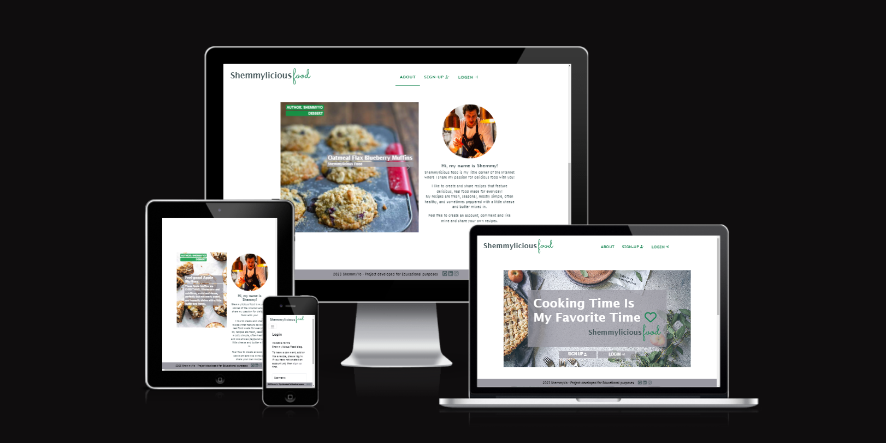

# Portfolio Project 4 - Full-Stack Toolkit

<video width="640" height="480" autoplay>
  <source src="README/p-hero-animation.mp4" type="video/mp4">
  <source src="movie.ogg" type="video/ogg">
Your browser does not support the video tag
</video>


## __Inspiring yet simple food recipes for delicious, everyday cooking__
Finding the right recipe is more difficult than ever. That's why we've made it simple.

Shemmylicious Food is a food recipe blog designed to allow the User to find and review recipes as well as join a community of like-minded people gathered around a passion for food and interested in exchanging their ideas and views on food.

## This is how easy it works!
1. Simply register, log in and create profile to join the Shemmylicious food-loving community.
2. Create or browse recipes, find the one you're inspired by and prepare Shemmylicious food.
3. Share your passion for food, comment and like Shemmylicious food blog...

The site features a search function that allows the User to search the db of recipes. 
Users can add recipes, like and comment on the newest recipes as well as view them by category and get in touch with other users. Users (after logging in) will be able to view Recipe details such as ingredients required, instructions, and other information (i.e: nutrition facts etc.) as well as comment and like recipes. 

Users will also be able to create and view customizable Profile pages, where they will be able to enter information about themselves, upload their profile picture as well as share other social media.

You can view the live, deployed to Heroku application here: <a href ='https://shemmylicious.herokuapp.com/' target="_blank">Shemmylicious Food</a>





## __Live Web-Page__
[Shemmylicious Food](https://shemmylicious.herokuapp.com/)

## __GitHub Repository__
[https://github.com/ShemmyYo/django-shemmylicious](https://github.com/ShemmyYo/django-shemmylicious)

## __Tech Stack__

                


***

# Contents

- [Overview](#shemmylicious-logo)
- [Project Goal](#project-goal)
- [UX User Experience](#ux-user-experiance)
    - [Design](#design)
        - [Colour Scheme](#colour-scheme)
        - [Typography](#typography)
        - [Imagery](#imaginary)
    - [Agile](#agile)
        - [The Ideal User/Persona](#the-ideal-user)
        - [Epics & Admin/User Stories](#user-stories)
        - [MoSCoW Prioritization](#moscow-prioritization)
    - [Wireframes](#wireframes)
- [Features](#features)
    - [Existing Features](#existing-features)
        - []()
    
    - [Future Features]()
- [Tools & Technologies Used](#technologies-used)
    - [Languages Used](#languages-used)
    - [Frameworks & Tools](#frameworks--tools)
    - [Imported Libraries and Packages](#libraries-imported)
    - [Data Model](#data-model)
- [Testing](#testing)
- [Deployment](#deployment)
    - [ElephantSQL](#elephantsql-database)
    - [Cloudinary API](#cloudinary-api)
    - [Heroku Deployment](#heroku-deployment)
    - [Local Deployment](#local-deployment)
    - [Cloning](#cloning)
    - [Forking](#forking)
- [Credits](#credits)
- [Acknowledgements](#acknowledgements)

***

# Project Goal

The project goal was to build a Full-Stack site based on business logic and create user friendly, commerially focused project that uses HTML, CSS, JavaScript, Python+Django as well as centrally-owned dataset (ElephantSQL relational database).

In this project I will present my ability to:

- use Agile methodologies (agile tool - Github projects) to track the tasks involved in creating the project relating to identified user stories.

- implement front-end CRUD (Create Read Update Delete) functionality, including front-end UI that allows users to Create, Read, Update, and Delete records in the database, without having to access the admin panel.

- set up an authentication mechanism and provide role-based access to the site's data or other activities based on the dataset.

[Back to top &uarr;](#content)

***

# UX User Experiance

## Design

### Colour Scheme
***
I opted for a very minimalistic aesthetic and only apllied 3 colours (2 with additional shades) to this project.

```css
root {
    --background-col: #45575A;
    --light-gray-col: #9A99A2;
    --light-col: #E4E5EA;
    --accent-col: #3DC073;
    --basic-col: #198754;
}
```

To provide a better user experience, I went for a bright theme with an hints of green to add spice to the site. 
The colours have been implemented across the site and are included in the buttons/links and their hover effects.

I used  [Colormind](http://colormind.io/) colour scheme for this project:


[Back to top &uarr;](#content)

### Typography
***
The two fonts used were imported into the CSS from [Google Fonts](https://fonts.google.com/)
[Font Awesome](https://fontawesome.com) icons were used throughout the site, such as the social media icons in the footer.

I used 'Sen' for logo, menues and all headings.


'Lucida Sans' has been used as a additional font for paragraphs any other text.
'Sans-serif' is the nominated fallback font.

```CSS 
root {
    --main-font: 'Sen', sans-serif;
    --additional-font: 'Lucida Sans', 'Lucida Sans Regular', 'Lucida Grande', 'Lucida Sans Unicode', Geneva, Verdana, sans-serif;
}
```

[Back to top &uarr;](#content)

### Imaginary
***

I designed a Shemmylicious logo with  [Figma](https://www.figma.com/)

same logo has then been used to create [Favicon](https://favicon.io/) icons.


[Back to top &uarr;](#content)

***
## Agile 

### The Ideal User/Persona

Food blog users are passionate about all things culinary and seek to expand their knowledge and skills in the kitchen, while also enjoying the social aspects of sharing their experiences with others.

**Who**: This persona is passionate about food and enjoys exploring new flavors and cuisines. They are likely to prioritize taste over convenience or health benefits. Marketing messages that emphasize the unique and delicious flavors of your products, as well as the high quality ingredients, will appeal to this persona.
A women aged 25 to 34 are our biggest recipe-browsing demographic group. But that's followed closely by women, ages 55 to 64.

**What**: A food blog user is typically someone who is interested in cooking, eating, and exploring different types of cuisine. They may be a beginner cook looking for recipe inspiration, or a more experienced cook looking to expand their knowledge and skills in the kitchen. 

**Why**: Some common characteristics of a food-blog user include:

- Food Enthusiast: They have a passion for food and enjoy trying new recipes and ingredients.
- Health Conscious: They may be interested in healthy eating and look for recipes that are nutritious and balanced.
- Adventurous: They enjoy trying new things and experimenting with different flavors and cuisines.
- Time-Conscious: They may be looking for recipes that are quick and easy to prepare, or that can be made ahead of time for convenience.
- Social: They may enjoy sharing their own food experiences with others, and may be active on social media platforms related to food and cooking.
- Budget-Conscious: They may be looking for recipes that are affordable and that use ingredients that are readily available.
- Knowledge-Seeking: They may be interested in learning more about different types of cuisine, cooking techniques, and food history.
- Community-Oriented: They may be interested in connecting with other food enthusiasts and bloggers, and may participate in online forums or groups related to food and cooking.

[Back to top &uarr;](#content)

***
### Epics & Admin/User Stories

10 Epics (milestones) were created which were then further developed into 39 User Stories. 

__EPIC: [Initial Django Setup](https://github.com/ShemmyYo/django-shemmylicious/milestone/1)__

- ADMIN STORY: As an Admin I will set up Django and install the supporting libraries predicted to be needed so that I am ready to start development `MUST HAVE`
- ADMIN STORY: As an Admin I need to create the env.py and add to .gitignore so that I can securely deploy the site without exposing the developer `MUST HAVE`
- ADMIN STORY: As an Admin I can deploy the site to Heroku early so that I can confirm everything works before the development of the site and to enable continuous testing within the production environment `MUST HAVE`


__EPIC: [Base Html/Homepage/index](https://github.com/ShemmyYo/django-shemmylicious/milestone/9)__

- USER STORY: As a User, I would like to view the site on my different devices so that I can view the site on the go `MUST HAVE`
- USER STORY: As a User I want to see a clear way of navigating the site so that I can find the information relative to my needs `MUST HAVE`
- USER STORY: As a User, I want to be shown an interesting, inviting index page so that I know exactly what is the page about and it gives me an enhanced experience `MUST HAVE`
- USER STORY: As a User, I want to be able to get in touch with the Developer so that I can enquire about issues/suggestions I may have `MUST HAVE`


__EPIC: [User Authorisation Signup/Login/Logout](https://github.com/ShemmyYo/django-shemmylicious/milestone/3)__

- ADMIN STORY: As an Admin I want to install and import the AllAuth library to the project so that I can use it to manage users `MUST HAVE`
- ADMIN STORY: As an Admin I want to add functionality to verify email and reset the password so that the user has better security over their email being used and can reset the password if they forget it `COUNLD HAVE`
- USER STORY: As a User, I want to be able to signup/login/logout securely so that I can view/edit my profile `COULD HAVE`
- USER Story: As a User, I would like to access my profile so that I can upload an image or alter my bio, social media links etc. `SHOULD HAVE`
- USER STORY: As a User, I would like to access my profile with single sign login so that I can  login quicker and more securely `WONT HAVE`

__EPIC: [View Recipe Details](https://github.com/ShemmyYo/django-shemmylicious/milestone/5)__

- USER STORY: As a User, I want to view the recipe details so that I can read the ingredients, instructions etc. `MUST HAVE`
- ADMIN STORY: As an Admin I want to build a page to display recipes for the users so that they have a clear overview and can find the information they look for `MUST HAVE`
- USER STORY: As a User, I want to view my recipes listed on my page so that I can edit recipe details (e.g.ingredients, instructions etc.) or delete my recipe `MUST HAVE` 
- ADMIN STORY: As an Admin I want to create a Recipe model so that the recipe details can be viewed/edited and added to the database `MUST HAVE`

__EPIC: [CRUD Functionality](https://github.com/ShemmyYo/django-shemmylicious/milestone/8)__

- USER STORY: As a user, I want to be able to click on a recipe so that I can read the full-text `MUST HAVE`
- USER STORY: As a User, I want to be able to view my recipes so that I can edit or delete them `MUST HAVE`
- ADMIN STORY: As an Admin, I want to be able to login to Admin Panel so that I can CRUD manage data `MUST HAVE`

__EPIC: [Recipe Search](https://github.com/ShemmyYo/django-shemmylicious/milestone/5)__

- USER STORY: As a User, I want to have a section where I can search for a Recipe so that I can easily find it access it and comment/like it `SHOULD HAVE`
- ADMIN STORY: As an Admin I want to create the recipe search url, view & template so that the User can search db `SHOULD HAVE`

__EPIC: [View Recipe List by Category](https://github.com/ShemmyYo/django-shemmylicious/milestone/4)__

- USER STORY: As a User, I want to be able to view the recipes by category so that I can easily find what I'm interested in `SHOULD HAVE`
- ADMIN STORY: As an Admin I want to build a page to display recipes by category for the users so that they have a clear overview and can find the information they look for `SHOULD HAVE`


__EPIC: [User Account/Profile](https://github.com/ShemmyYo/django-shemmylicious/milestone/2)__

- USER STORY: As a User, I want to have access to my Profile so that I can upload an image or change my bio or social media urls `SHOULD HAVE`
- ADMIN STORY: As an Admin I will create a User Profile page so that they can update their details and setting `SHOULD HAVE`

__EPIC: [Recipe Comments & Likes](https://github.com/ShemmyYo/django-shemmylicious/milestone/6)__

- USER STORY: As a User, I want the ability to like or comment on recipes so that I can share my thoughts and feel included in the community `MUST HAVE`
- USER STORY: As a User, I want the ability to view all comments for the recipe so that I can see what my fellow commenters think of a recipe `MUST HAVE`
- USER STORY: As a User, I would like the ability to edit my review so that I can fix any spelling or format issues `COULD HAVE`
- ADMIN STORY: As an Admin I will provide commenting/like functionality for the User so that they have an enjoyable experience reviewing/liking recipes `MUST HAVE`
- ADMIN STORY: As an Admin I want to have the ability to delete any comment so that I can manage comments effectively `MUST HAVE`

__EPIC: [Status Error Templates](https://github.com/ShemmyYo/django-shemmylicious/milestone/10)__

- ADMIN STORY: As an Admin I will implement a 400 bad request page to redirect the user to the home page `COULD HAVE`
- ADMIN STORY: As an Admin I will implement a 403 error page to redirect the user to the home page `COULD HAVE`
- ADMIN STORY: As an Admin I will implement a 404 error page so that I can alert users when they have accessed a page that doesn't exist and redirect the user to the home page `COULD HAVE`
- ADMIN STORY: As an Admin I will implement a 500 error page so that I can alert users when an internal server error occurs and redirect the user to the home page `COULD HAVE`

__EPIC: [Complete Documentation](https://github.com/ShemmyYo/django-shemmylicious/milestone/7)__

- ADMIN STORY: Create/Write README.md
- ADMIN STORY: Create/Write TESTING.md

[Back to top &uarr;](#content)

***
### MoSCoW Prioritization

This project was developed using agile methodologies by delivering small features (User Stories) across the project.

The Kanban board was created using Github projects and can be located [here](https://github.com/users/ShemmyYo/projects/5/views/1) and can be viewed to see more information on the project cards. 

Using this approach, I was able to apply the MoSCow prioritization and label user stories.
User Stories were assigned to Epics, prioritized under the labels:

- `MUST HAVE` - guaranteed to be delivered (*max 60% of stories*)
- `SHOULD HAVE` - adds significant value, but not vital (*the rest ~20% of stories*)
- `COULD HAVE` - has small impact if left out (*20% of stories*)
- `WON'T HAVE` - not a priority for this iteration

To ensure that all core requirements were completed I worked on the 'MUST HAVE' epics/user stories first.

A few `COULD HAVE` user stories have been implemented before project due date i.e. ...

[Back to top &uarr;](#content)

***
## Wireframes
***


<details><summary>Desktop</summary>


</details>


500 Page

As a Developer I can implement a 500 error page so that I can alert users when an internal server error occurs

A 500 error page has been displayed to alert users when an internal server error occurs. The message relays to users that the problem is on our end, not theirs.

[Back to top &uarr;](#content)

***
## Features
***

### Existing Features

### Future Features


[Back to top &uarr;](#content)

## Tools & technologies used

### Languages Used

- [HTML5](https://html.spec.whatwg.org/) used for page content and structure 
- [CSS](https://www.w3.org/Style/CSS/Overview.en.html) used for page styling
- [Javascript](https://www.javascript.com/) used for dynamically updated content
- [Python](https://www.python.org/) - used for the functionality of the program

### Frameworks & Tools

- [Django](https://www.djangoproject.com/) used as main python framework
- [Bootstrap](https://blog.getbootstrap.com/) used for page layout and spacing
- [PostgreSQL](https://www.postgresql.org) used for database management
- [ElephantSQL](https://www.elephantsql.com/) used for production database
- [Cloudinary](https://cloudinary.com/) used to store static files and images
- [Heroku](https://dashboard.heroku.com/apps) used to deploy application
- [Gitpod](https://www.gitpod.io/) used to create and host the website
- [Github](https://github.com/) used to deploy the website 
- [Balsamiq](https://balsamiq.com/) used to create page wireframes
- [Stackoverflow](https://stackoverflow.com/) used to troubleshoot code issues
- [CI Python Linter](https://pep8ci.herokuapp.com/) used as Python code validator
- [Chrome Dev Tools](https://developer.chrome.com/docs/devtools/)
- [MindManager](https://app.mindmanager.com/) - for Flowcharts
- [Grammarly](https://www.grammarly.com/) used to check typography
- []() used to generate the Database diagram
- [Technisini](https://techsini.com/multi-mockup/index.php) mockup image of the home page on various devices 

### Imported Libraries and Packages

- [gunicorn]() - Python WSGI HTTP Server for UNIX
- [psycopg2]() - PostgreSQL database adapter for Python
- [cloudinary]() - Python package allowing integration between the application and Cloudinary
- [dj-database-url]() - Django utility to utilise the DATABASE_URL environment variable to configure the Django application. Used with PostgreSQL
- [dj3-cloudinary-storage]() - Django package that facilitates integration with Cloudinary storage
- [Django]() - Python package for the Django framework
- [django-allauth]() - Django user authentication, registration and account management
- [django-crispy-forms]() - - Django package that provides tags and filters to control the rendering behaviour of Django forms
- [django-richtextfield]() - - Model field for rich text editing

[Back to top &uarr;](#content)

### Data Model

- Table: **Product**

    | **PK** | **id** (unique) | Type | Notes |
    | --- | --- | --- | --- |
    | **FK** | category | ForeignKey | FK to **Category** model |
    | | sku | CharField | |
    | | name | CharField | |
    | | description | TextField | |
    | | has_sizes | BooleanField | |
    | | price | DecimalField | |
    | | rating | DecimalField | |
    | | image_url | URLField | |
    | | image | ImageField | |


[Back to top &uarr;](#content)

## Testing

For all testing, please refer to the [TESTING.md](TESTING.md) file.


***
### __Browser Compatibility__

After publishing to Heroku, the site was tested on Google Chrome, Microsoft Edge, Safari and Mozilla Firefox, with no visible issues for the user. 
The site has loaded perfectly and had no issues across all browsers.

[Back to top &uarr;](#content)

***
## Deployment

The live deployed application can be found deployed on [Heroku](https://shemmylicious.herokuapp.com).

***
### ElephantSQL Database

This project uses [ElephantSQL](https://www.elephantsql.com) for the PostgreSQL Database.

To obtain your own Postgres Database, sign-up with your GitHub account, then follow these steps:
- Click **Create New Instance** to start a new database.
- Provide a name (this is commonly the name of the project: tribe).
- Select the **Tiny Turtle (Free)** plan.
- You can leave the **Tags** blank.
- Select the **Region** and **Data Center** closest to you.
- Once created, click on the new database name, where you can view the database URL and Password.

[Back to top &uarr;](#content)

***
### Cloudinary API

This project uses the [Cloudinary API](https://cloudinary.com) to store media assets online, due to the fact that Heroku doesn't persist this type of data.

To obtain your own Cloudinary API key, create an account and log in.
- For *Primary interest*, you can choose *Programmable Media for image and video API*.
- Optional: *edit your assigned cloud name to something more memorable*.
- On your Cloudinary Dashboard, you can copy your **API Environment Variable**.
- Be sure to remove the `CLOUDINARY_URL=` as part of the API **value**; this is the **key**.

[Back to top &uarr;](#content)

***
### Heroku Deployment

[Setting up basic Django Project and Deploying to Heroku CI Doc](https://docs.google.com/document/d/1P5CWvS5cYalkQOLeQiijpSViDPogtKM7ZGyqK-yehhQ/edit)

This project uses [Heroku](https://www.heroku.com), a platform as a service (PaaS) that enables developers to build, run, and operate applications entirely in the cloud.

Deployment steps are as follows, after account setup:

1. Select *New* in the top-right corner of your Heroku Dashboard, and select *Create new app* from the dropdown menu.
1. Your app name must be unique, and then choose a region closest to you (EU or USA), and finally, select *Create App*.
1. Further down, to support dependencies, select *Add Buildpack*.
1. The order of the buildpacks is important, select `Python` first, then `Node.js` second. (if they are not in this order, you can drag them to rearrange them)
1. From the new app *Settings*, click *Reveal Config Vars*, and set your environment variables.

    
    - CLOUNDINARY_URL: (Enter Cloudinary API URL)
    - DATABASE_URL: (Enter the database URL from ElephantSQL)
    - PORT: 8000
    - DISABLE_COLLECTSTATIC: 1 (must be removed before final deployment)
    - SECRET_KEY: (Enter your secret key)

Heroku needs two additional files in order to deploy properly.
- requirements.txt
- Procfile

You can install this project's *requirements* (where applicable) using:
- `pip3 install -r requirements.txt`

If you have your own packages that have been installed, then the requirements file needs updated using:
- `pip3 freeze --local > requirements.txt`

The *Procfile* can be created with the following command:
- `echo web: gunicorn app_name.wsgi > Procfile`
- *replace *app_name* with the name of your primary Django app name; the folder where settings.py is located*

For Heroku deployment, follow these steps to connect your own GitHub repository to the newly created app:

Either:
- Select *Automatic Deployment* from the Heroku app.

Or:
- In the Terminal/CLI, connect to Heroku using this command: `heroku login -i`
- Set the remote for Heroku: `heroku git:remote -a <app_name>` (replace app_name with your app, without the angle-brackets)
- After performing the standard Git `add`, `commit`, and `push` to GitHub, you can now type:
	- `git push heroku main`

The project should now be connected and deployed to Heroku!

[Back to top &uarr;](#content)

***
### Local Deployment

This project can be cloned or forked in order to make a local copy on your own system.

For either method, you will need to install any applicable packages found within the *requirements.txt* file.
- `pip3 install -r requirements.txt`.

You will need to create a new file called `env.py` at the root-level,
and include the same environment variables listed above from the Heroku deployment steps.

Sample `env.py` file:

```python
import os

os.environ.setdefault("CLOUDINARY_URL", "insert your own Cloudinary API key here")
os.environ.setdefault("DATABASE_URL", "insert your own ElephantSQL database URL here")
os.environ.setdefault("SECRET_KEY", "this can be any random secret key")

# local environment only (do not include these in production/deployment!)
os.environ.setdefault("DEBUG", "True")
```

Once the project is cloned or forked, in order to run it locally, you'll need to follow these steps:
- Start the Django app: `python3 manage.py runserver`
- Stop the app once it's loaded: `CTRL+C` or `⌘+C` (Mac)
- Make any necessary migrations: `python3 manage.py makemigrations`
- Migrate the data to the database: `python3 manage.py migrate`
- Create a superuser: `python3 manage.py createsuperuser`
- Load fixtures (if applicable): `python3 manage.py loaddata file-name.json` (repeat for each file)
- Everything should be ready now, so run the Django app again: `python3 manage.py runserver`

[Back to top &uarr;](#content)

***
#### Cloning

You can clone the repository by following these steps:

1. Go to the [GitHub repository](https://github.com/ShemmyYo/django-shemmylicious) 
2. Locate the Code button above the list of files and click it 
3. Select if you prefer to clone using HTTPS, SSH, or GitHub CLI and click the copy button to copy the URL to your clipboard
4. Open Git Bash or Terminal
5. Change the current working directory to the one where you want the cloned directory
6. In your IDE Terminal, type the following command to clone my repository:
	- `git clone https://github.com/ShemmyYo/django-shemmylicious.git`
7. Press Enter to create your local clone.

Alternatively, if using Gitpod, you can click below to create your own workspace using this repository.

[](https://gitpod.io/#https://github.com/ShemmyYo/django-shemmylicious)

Please note that in order to directly open the project in Gitpod, you need to have the browser extension installed.
A tutorial on how to do that can be found [here](https://www.gitpod.io/docs/configure/user-settings/browser-extension).

[Back to top &uarr;](#content)

***
#### Forking

By forking the GitHub Repository, we make a copy of the original repository on our GitHub account to view and/or make changes without affecting the original owner's repository.
To make a copy or ‘fork’ the repository - 

1. Log into GitHub and locate the repository  
2. On the right-hand side of the page select the ‘fork’ option to create and copy the original

Alternatively, if using Gitpod, you can click below to create your workspace using this repository

[Back to top &uarr;](#content)

***
## Credits

Throughout the building process I found many helpful tutorials online.
I sometimes applied principles within them to the site, after fully understanding their code and modifying to fit the site's needs.

1. [Code Institute Template](https://github.com/Code-Institute-Org/python-essentials-template) - This repository was created using the template provided by Code Institute.
1. [Django Documentation](https://docs.djangoproject.com/en/4.0/) - Django step-by-step document to ensure everything is set up correctly.
1. [Setting up basic Django Project and Deploying to Heroku](https://docs.google.com/document/d/1P5CWvS5cYalkQOLeQiijpSViDPogtKM7ZGyqK-yehhQ/edit) - Documentation on how to create django project provided by [Code Institute](https://codeinstitute.net/ie/) 
1. [Allauth Documentation](https://django-allauth.readthedocs.io/en/latest/faq.html) - referenced during development.
1. [Cloudinary Documentation](https://cloudinary.com) - referenced during development.
1. [Summernote Documentation](https://summernote.org/) and [Git](https://github.com/summernote/django-summernote) - referenced during development.
1. [Crispy Forms Documentation](https://django-crispy-forms.readthedocs.io/en/latest/) - referenced during development.
1. [John Elder - Django Wednesdays](https://www.youtube.com/playlist?list=PLCC34OHNcOtqW9BJmgQPPzUpJ8hl49AGy) - YouTube series that has inpired me to create a blog-like application. 
1. [Building a Social Media App With Python 3 & Django Beginners Tutorial](https://www.youtube.com/playlist?list=PLPSM8rIid1a3TkwEmHyDALNuHhqiUiU5A) - YouTube series that has helped me to create a blog-like application. 
1. [Stackoverflow](https://stackoverflow.com/) - I found myself on Stackoverflow so many times researching issues. This a fantastic place to learn and troubleshoot code.
1. [Slack](https://slack.com/intl/en-ie/) - The slack community is great and I reached out to fellow students who had already completed their P4 for their advice and got some nice tips and feedback. I attending some webinars by CI staff which I found very beneficial.

[Back to top &uarr;](#content)

***
## Acknowledgements

As always, big thank you to [Harry Dhillon](https://github.com/Harry-Leepz), my mentor who provided me with guide and excellent feedback throughout the project

Shemmylicious Food was developed for educational purpouses and as part of my Diploma in Software Development with [Code Institute](https://codeinstitute.net/). 

[Back to top &uarr;](#content)