# Browser Compatibility

After publishing to Heroku, the site was tested on Google Chrome, Microsoft Edge, Safari and Mozilla Firefox, with no visible issues for the user. 
The site has loaded perfectly and had no issues across all browsers.

# __Validation__

## __HTML__

 >>> Click for Recipe validation img

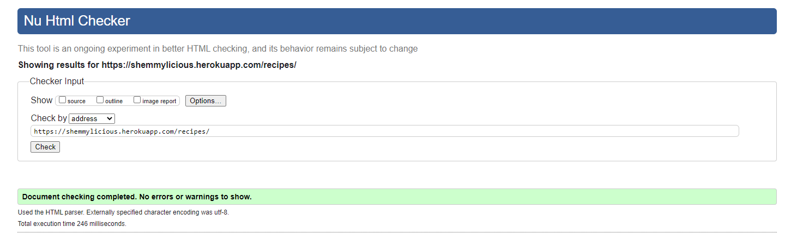

 >>> Click for Add Recipe validation img

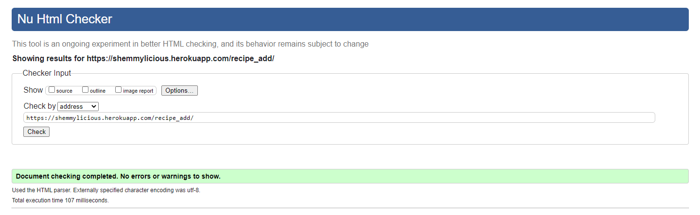

 >>> Click for Categories validation img

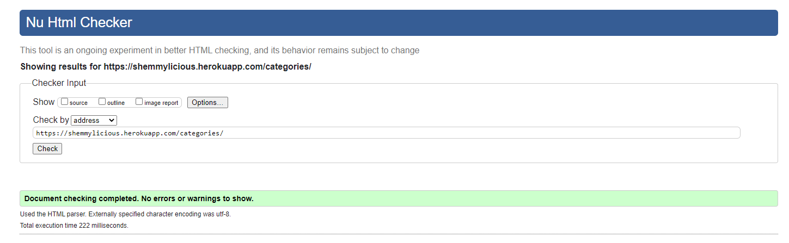

 >>> Click for My Recipes validation img

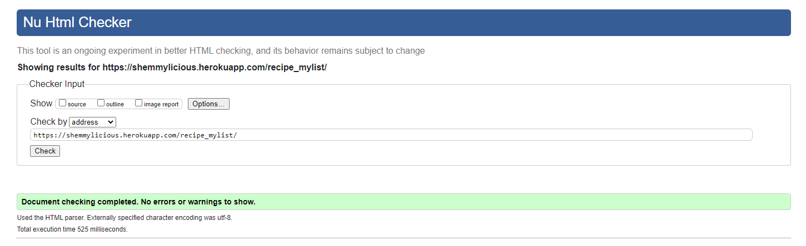

 >>> Click for Profile Edit validation img

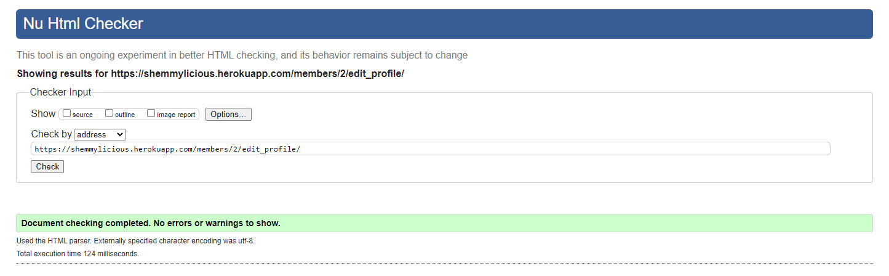

 >>> Click XXX validation img

[Back to top &uarr;](#validation)
***
## __CSS__

 >>> Click for CSS validation img

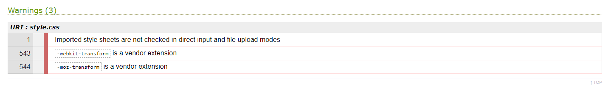

[Back to top &uarr;](#validation)
***
## __Lighthouse__

## __PEP8 CI Validation__

***
app: __shemmylicious__

 >>> Click for urls.py validation img

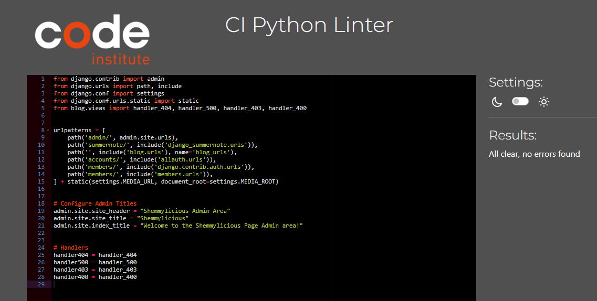

[Back to top &uarr;](#validation)
***
app: __members__

 >>> Click for urls.py validation img

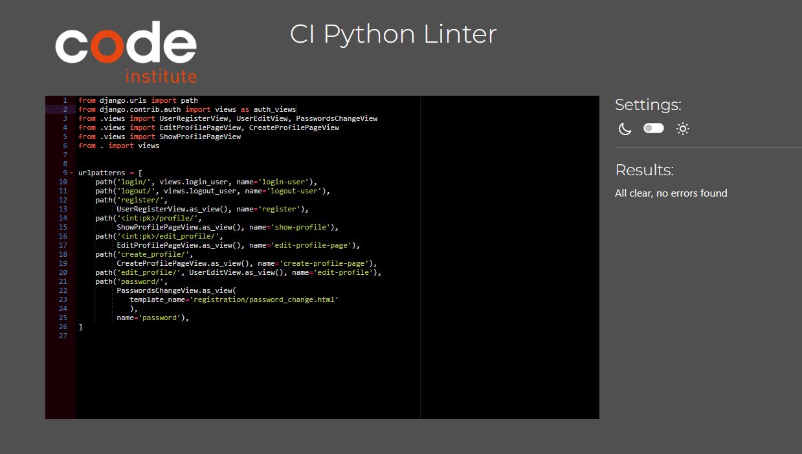

 >>> Click for views.py validation img

 >>> Click for forms.py validation img

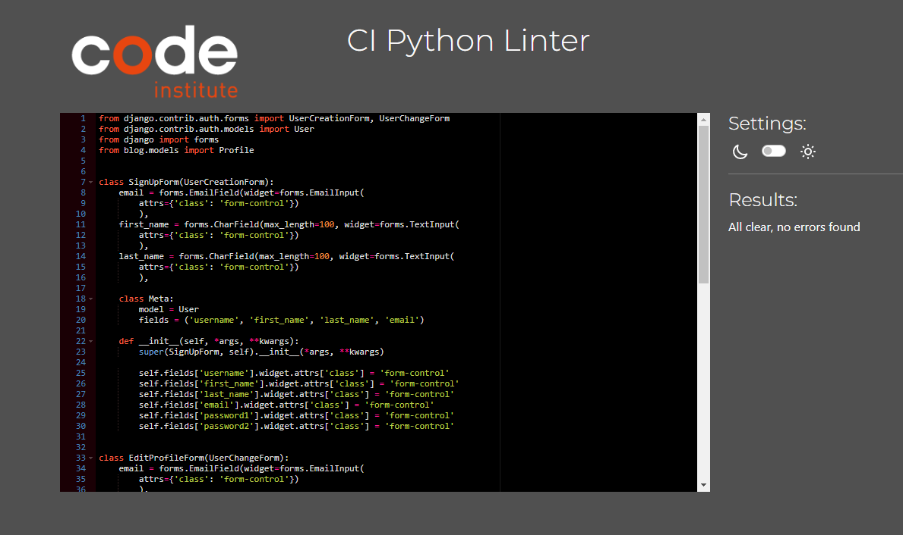

[Back to top &uarr;](#validation)
***
app: __blog__

 >>> Click for urls.py validation img

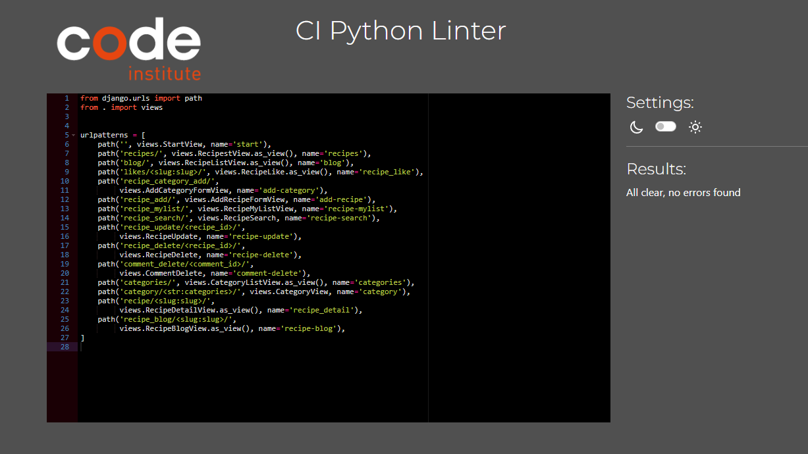

 >>> Click for views.py validation img

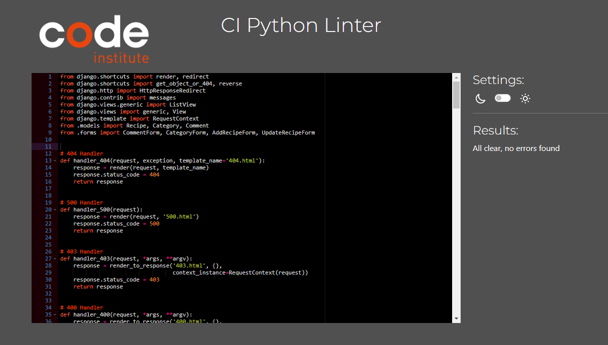

 >>> Click for forms.py validation img

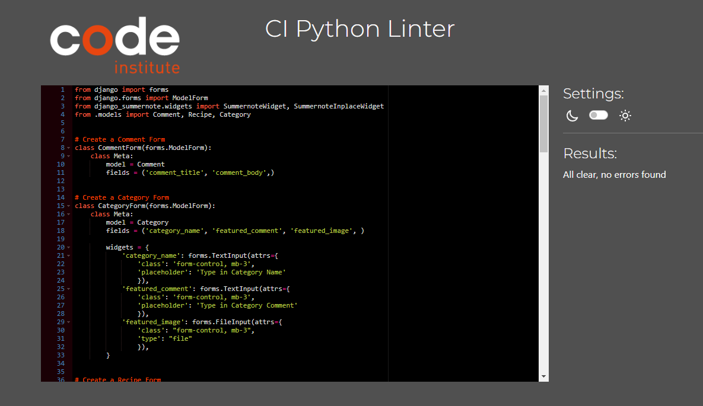

 >>> Click for models.py validation img

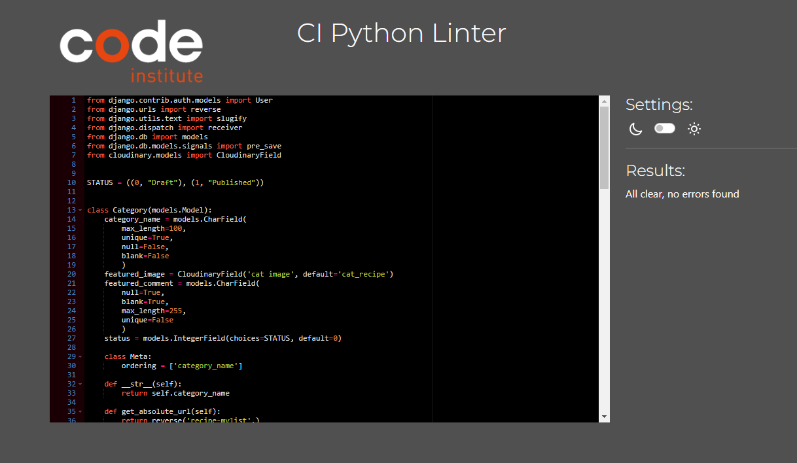

 >>> Click for admin.py validation img

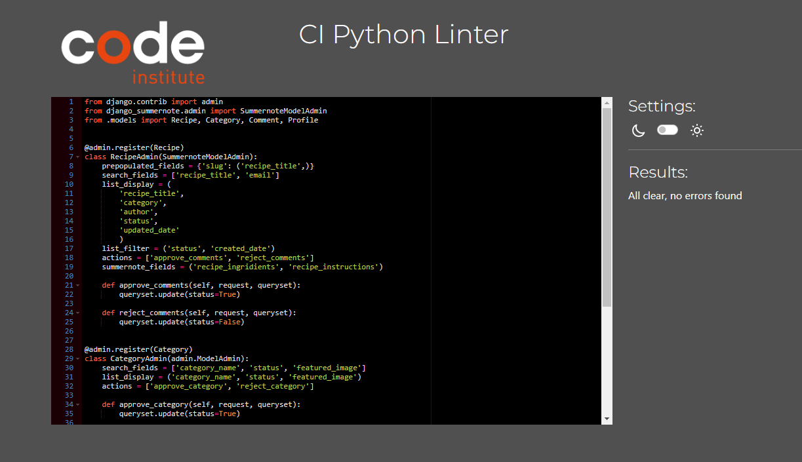

[Back to top &uarr;](#validation)
***

    - [Manual tests](#manual-tests)
    - 
    - [Bugs](#bugs)
    - [Browser Compatibility](#browser-compatibility)

   
## Tests based on user stories

|     |                                   Story                     | Result |
| --- | :----------------------------------------------------------: | :-------------: |
| 1   |        | Yes             |

***

## Manual tests:

### __Welcome Screen__

 >>> Click for details

- Welcome screen has loaded correctly and as intended.
- Verified that the user can submit the Player name and city.
- Input is verified and only letters are accepted.

---

***

### __Bugs:__
#### __get_lines function__

***

#### __Known Bugs__

***
Back to [README.md](README.md) file.