# Browser Compatibility

After publishing to Heroku, the site was tested on Google Chrome, Microsoft Edge, Safari and Mozilla Firefox, with no visible issues for the user. 

The site has loaded correctly and had no issues across all browsers.

[Back to top &uarr;](#browser-compatibility)

# __Validation__

## __HTML__

All pages were run through the [W3C Markup Validator](https://validator.w3.org/nu/). 

Initially, there were some errors due however all errors have been rectified.

 >>> Click for Home validation img

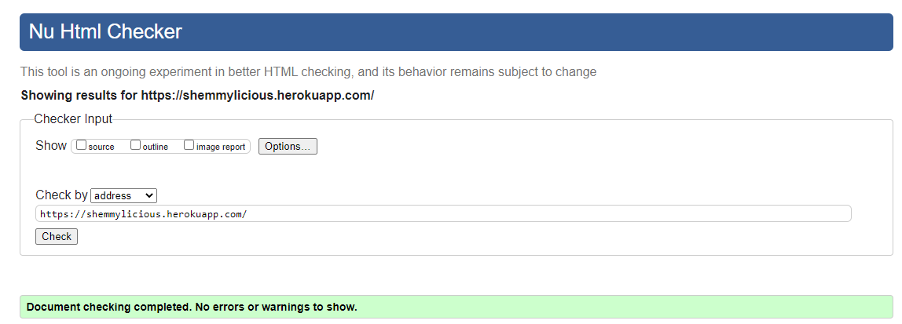

 >>> Click for Recipe validation img

 >>> Click for Recipe Details validation img

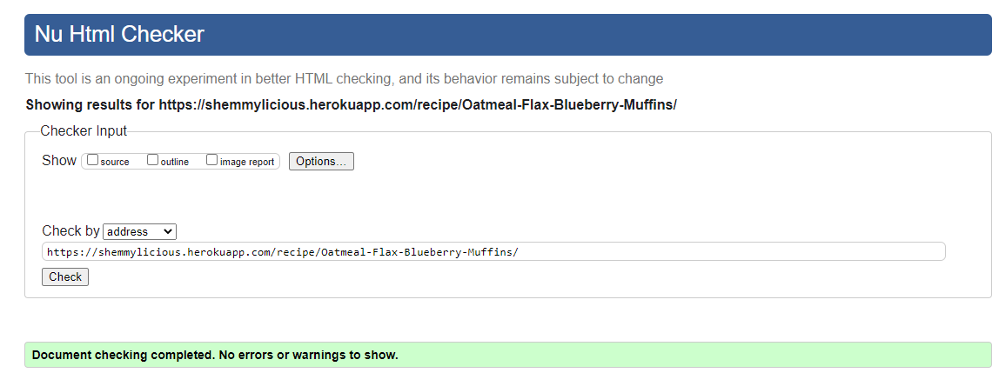

 >>> Click for My Recipes validation img

 >>> Click for Add Recipe validation img

 >>> Click for Edit Recipe validation img

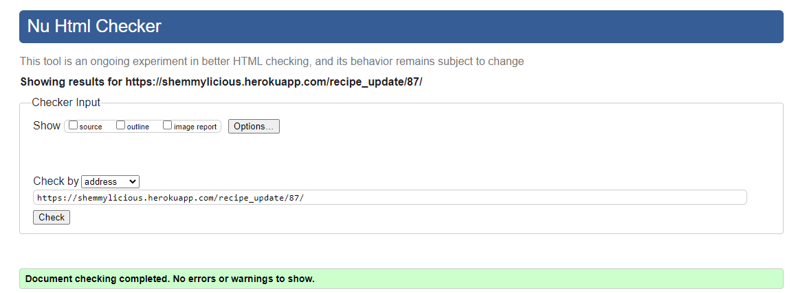

 >>> Click for Categories validation img

 >>> Click for Categories Details validation img

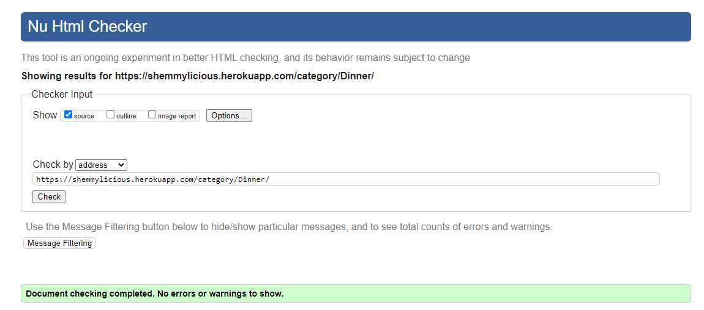

 >>> Click for Add Category (Superuser) validation img

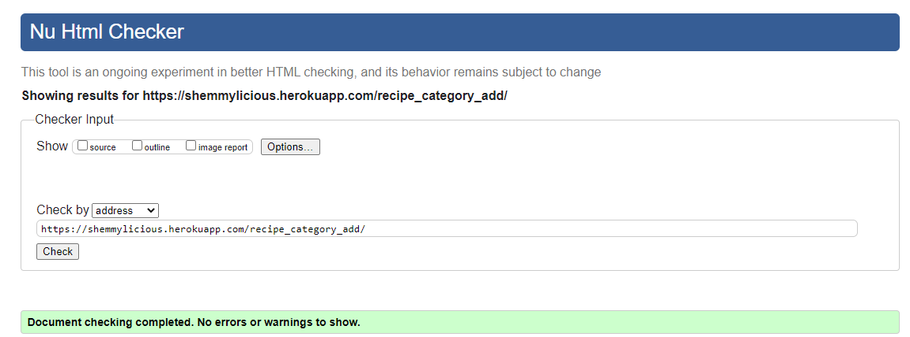

 >>> Click for Blog Details validation img

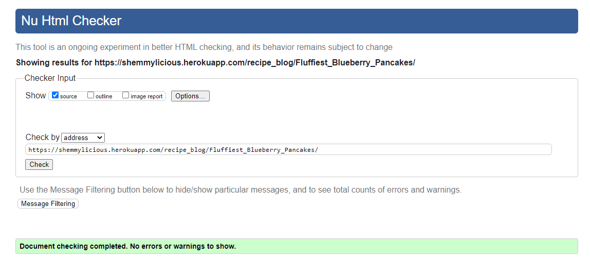

 >>> Click for Profile validation img

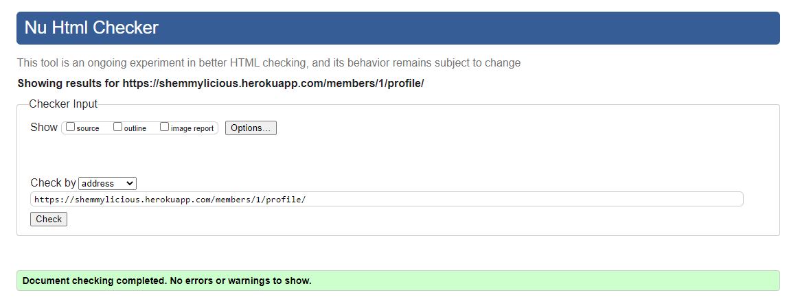

 >>> Click for Profile Edit validation img

 >>> Click for Edit Profile Bio validation img

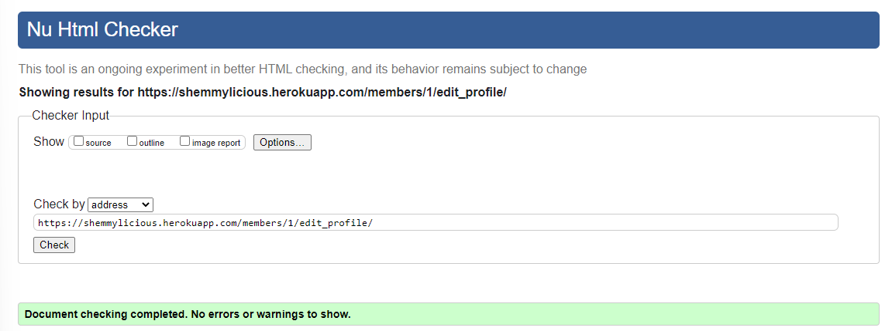

 >>> Click for Profile Logout validation img

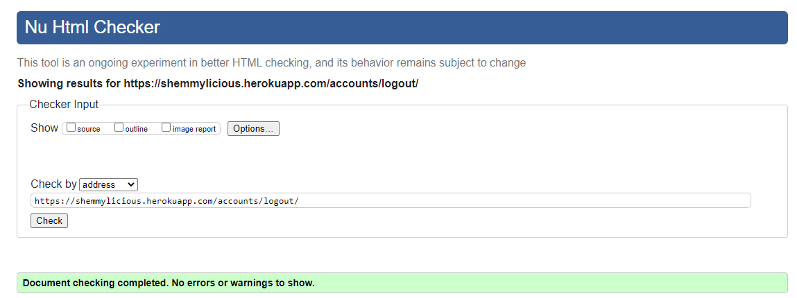

 >>> Click for Profile Login validation img

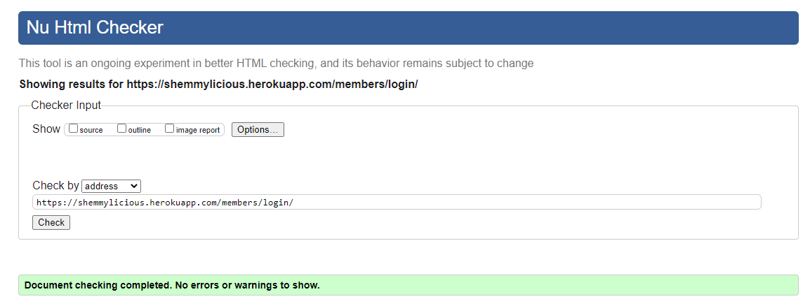

 >>> Click for Register Profile validation img

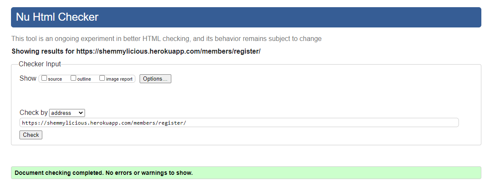

[Back to top &uarr;](#browser-compatibility)

***

## __CSS__
[W3C CSS Validator](https://jigsaw.w3.org/css-validator/) was used to validate the site's CSS code.

All issued rectified.

[Back to top &uarr;](#browser-compatibility)

***

## __JS__

[JSHint](https://jshint.com/) was used to validate the Javascript code used in the project. 

Four undefined variable are showing GSAP which is used in index page.  

No other issues to report.

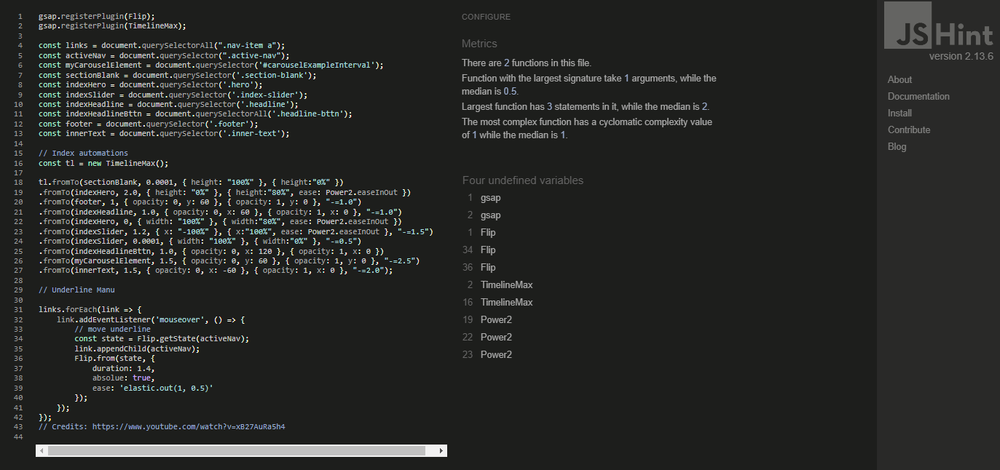

[Back to top &uarr;](#browser-compatibility)

***

## __Lighthouse__

Every page of the site was passed through the Lighthouse via the Chrome Dev Tools.

Performance issued are due mainly to image sizing however, some pages have shown also unused js code usage (GSAP code which in only used on index page) 

 >>> Click for Home Page Lighthouse Report

Desktop 

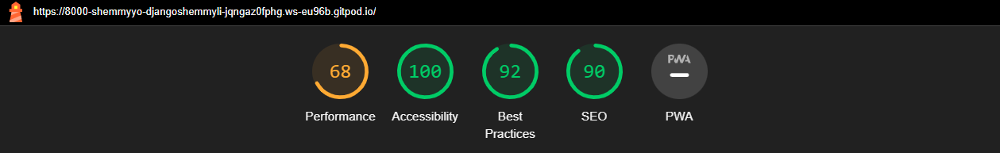
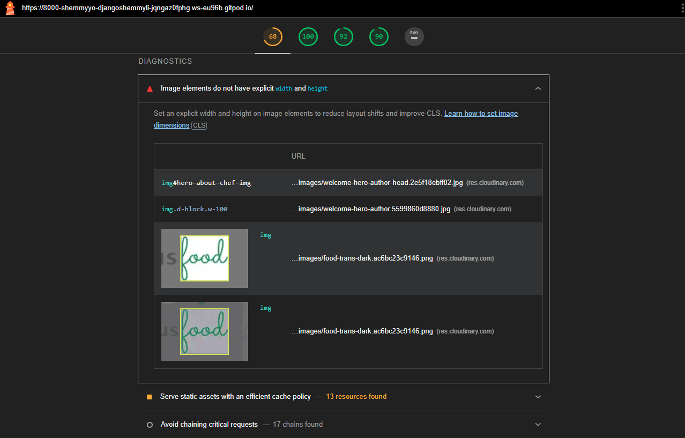

Mobile

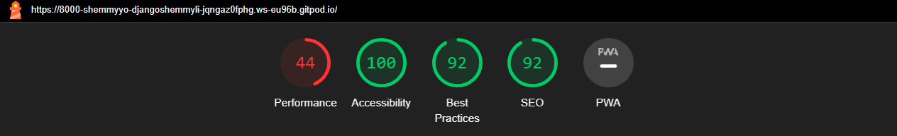
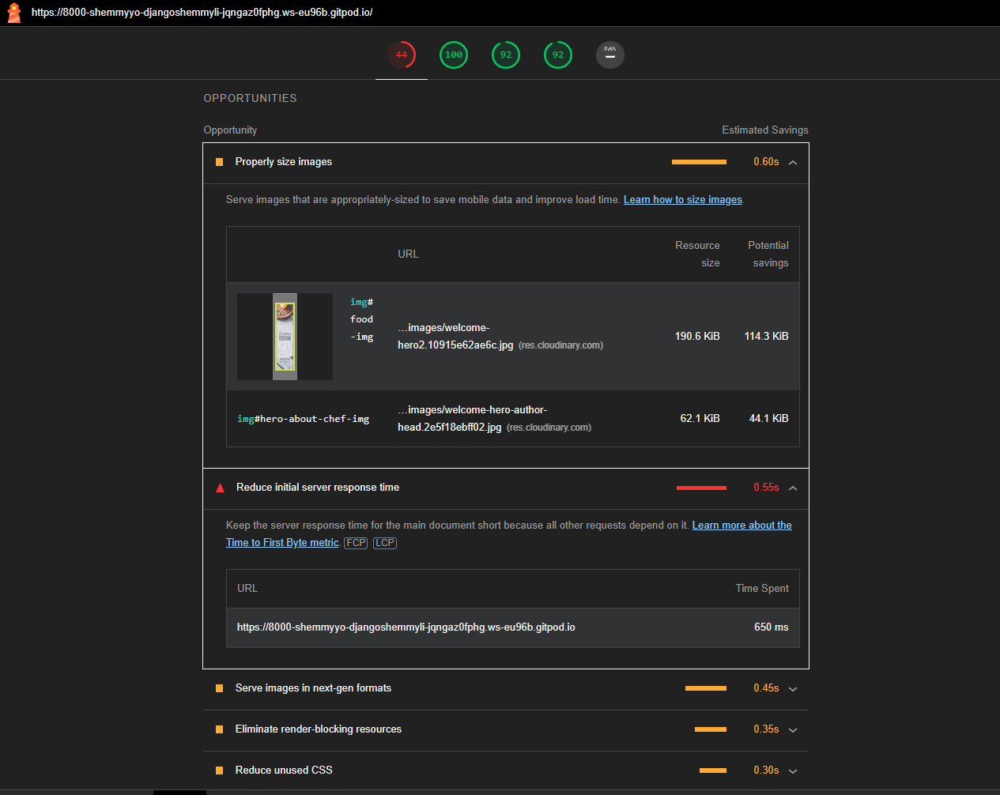

***

 >>> Click for Recipe Page Lighthouse Report

Desktop 

Mobile

***

 >>> Click for Recipe Details Page Lighthouse Report

Desktop 

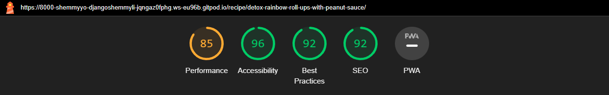

Mobile

***

 >>> Click for Category Page Lighthouse Report

Desktop 

Mobile

***

 >>> Click for Category List Page Lighthouse Report

Desktop 

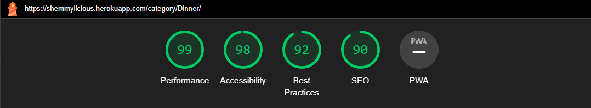

Mobile

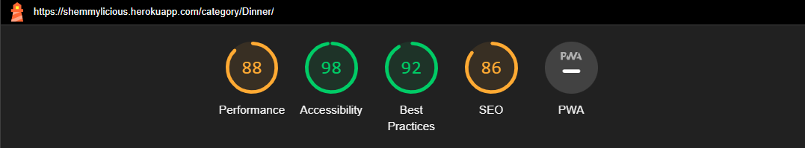

***

 >>> Click for Blog Page Lighthouse Report

Desktop 

Mobile

***

 >>> Click for Blog Details Lighthouse Report

Desktop 

Mobile

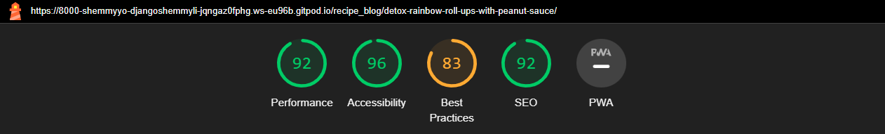

***

 >>> Click for Profile Page Lighthouse Report

Desktop 

Mobile

***

 >>> Click for Profile Bio Page Lighthouse Report

Desktop 

Mobile

***

 >>> Click for Profile Edit Page Lighthouse Report

Desktop 

Mobile

***

 >>> Click for Login Page Lighthouse Report

Desktop 

Mobile

[Back to top &uarr;](#browser-compatibility)

***

## __PEP8 CI Validation__

The [CI Python Linter](https://pep8ci.herokuapp.com/) was used to validate the python code used throughout the project. The results are outlined in below:

***

app: __shemmylicious__

 >>> Click for urls.py validation img

[Back to top &uarr;](#browser-compatibility)

***

app: __members__

 >>> Click for urls.py validation img

 >>> Click for views.py validation img

 >>> Click for forms.py validation img

[Back to top &uarr;](#browser-compatibility)

***

app: __blog__

 >>> Click for urls.py validation img

 >>> Click for views.py validation img

 >>> Click for forms.py validation img

 >>> Click for models.py validation img

 >>> Click for admin.py validation img

[Back to top &uarr;](#browser-compatibility)

***

# Manual tests:

## __Welcome Screen__

 >>> Click for details

Most features of the Shemmylicious Blog page are restricted to registered users. User is welcomed with animation which invates to registed. Some functions like Add Category, deleting comments or Admin page is restricted to Superusers only.

| Verification | Result |
| :----------------------------------------------------------: | :-------------: |
| Welcome screen has loaded correctly and as intended | Pass |
| Verified that the user can click sign-up button when not authenticated | Pass |
| Verified that the user can click login button when not authenticated | Pass |
| Verified that the user can click brows recipes button when authenticated | Pass |
| Verified that the user can click your recipes button when authenticated | Pass |
| Verified that the user can search recipe when authenticated | Pass |
| Verified that the user can scroll carousell pictures | Pass |
| Verified that the user can click each of footer links and all open on a new page | Pass |
| Verified that the user can click links in navbar and each link opens as intended | Pass |
| Verified that the user can click recipe link when authenticated | Pass |
| Verified that the user can click category link when authenticated | Pass |
| Verified that the user can click blog link when authenticated | Pass |
| Verified that the user can click user link when authenticated | Pass |
| Verified that the user can use a drop down link when authenticated | Pass |
| Verified that the user can choose user profile from user dropdown when authenticated | Pass |
| Verified that the user can choose user my recipe from user dropdown when authenticated | Pass |
| Verified that the user can choose user add recipe from user dropdown when authenticated | Pass |
| Verified that the user can logout from user profile dropdown when authenticated | Pass |
| Verified that the superuser can add category from user dropdown when authenticated | Pass |
| Verified that the superuser can go to django admin site from user dropdown when authenticated | Pass |

## __Sign Up__

 >>> Click for details

| Verification | Result |
| :----------------------------------------------------------: | :-------------: |
| Sign Up screen has loaded correctly and as intended | Pass |
| Varified that the User must type in correct characters in username, email and passwrods fields | Pass |
| Varified that the when all required info is provided, User account is created after pressing sign up button | Pass |
| Varified that after account is created, User menu shows only create profile link | Pass |

## __Login__

 >>> Click for details

| Verification | Result |
| :----------------------------------------------------------: | :-------------: |
| Login screen has loaded correctly and as intended | Pass |
| Varified that the User must type in username and passwrod to login | Pass |
| Varified that after login User is redirected to main screen | Pass |
| Varified that after login User is presented with correct nav links | Pass |
| Varified that after login User given all user rights | Pass |
| Varified that after login Superuser is redirected to main screen | Pass |
| Varified that after login Superuser is presented with correct nav links | Pass |
| Varified that after login Superuser given all superuser rights | Pass |

## __Search Recipe__

 >>> Click for details

| Verification | Result |
| :----------------------------------------------------------: | :-------------: |
| Search recipe screen has loaded correctly and as intended | Pass |
| Varified that the User is allowed to search recipe db when authenticated | Pass |
| Varified that the User is presented with search result page regardles of whether capital or lowercase characters are typed in | Pass |
| Varified that the User is redirected to search results screen once clicked 'Go'| Pass |
| Verified that the user can open recipes loaded from search results | Pass |
| Verified that the user can open author profile by clicking its name | Pass |
| Verified that the user can open category page by clicking category name | Pass |
| Verified that the user can go back to recipes page when clicking 'Home' | Pass |

## __Recipes Screen__

 >>> Click for details

| Verification | Result |
| :----------------------------------------------------------: | :-------------: |
| Recipes screen has loaded correctly and as intended | Pass |
| Verified that the user can open recipes loaded when authenticated | Pass |
| Verified that the user can open author profile by clicking its name | Pass |
| Verified that the user can open category page by clicking category name | Pass |
| Verified that pagination is working as intended | Pass |

## __Recipe Details Screen__ (after clicking recipe title)

 >>> Click for details

| Verification | Result |
| :----------------------------------------------------------: | :-------------: |
| Recipe detail screen has loaded correctly and as intended  | Pass |
| Verified that the user can like or unlike recipe when authenticated | Pass |
| Verified that when the user likes/ulikes recipe a relevant message pops up  | Pass |
| Verified that the user can write a comment when authenticated | Pass |
| Verified that when the user writes a comment a relevant message pops up  | Pass |
| Verified that the back to blog & back to recipes buttons work as intended | Pass |

## __Category Screen__ 

 >>> Click for details

| Verification | Result |
| :----------------------------------------------------------: | :-------------: |
| Category screen has loaded correctly and as intended | Pass |
| Verified that the categories load randomly each time page is reloaded | Pass |
| Verified that the user can click category name to open a list of recipes in chosen category | Pass |
| Verified that the list of categoriesed recipes is loading correctly | Pass |
| Verified that if the category does not contain any recipes, correct message and buttons are shown  | Pass |
| Verified that when no recipes to be displayed in category view  add recipe buttons is shown  | Pass |
| Verified that the back to category & back to recipes buttons work as intended | Pass |

## __Category details__ (after clicking one of the Categories)

 >>> Click for details

| Verification | Result |
| :----------------------------------------------------------: | :-------------: |
| Category detail screen has loaded correctly and as intended | Pass |
| Varified that the User is presented with all recipes in chosen category | Pass |
| Varified that the User is presented with a msg if no recipes in chosen category | Pass |
| Verified that the user can open recipes loaded when authenticated | Pass |
| Verified that the user can open author profile by clicking its name | Pass |
| Verified that the user can open category page by clicking category name | Pass |
| Varified that the User can create a new recipe is no recipes in category | Pass |
| Verified that the back to blog & back to recipes buttons work as intended | Pass |

## __Blog Screen__ 

 >>> Click for details

| Verification | Result |
| :----------------------------------------------------------: | :-------------: |
| Blog screen has loaded correctly and as intended | Pass |
| Verified that the User can open Recipe view by clicking its title | Pass |
| Verified that the User can open Author profile page by clicking 'Author' tag | Pass |
| Verified that the User can open Category page by clicking 'Category' tag | Pass |
| Verified that the User can continue reading blog by clicking 'CONTINUE READING' link | Pass |
| Verified that pagination is working as intended | Pass |

## __Blog Details Screen__ (after clicking blog title)

 >>> Click for details

| Verification | Result |
| :----------------------------------------------------------: | :-------------: |
| Blog detail screen has loaded correctly and as intended | Pass |
| Verified that Users comments are display correctly | Pass |
| Verified that the User pic/deatails display correctly | Pass |
| Verified that the User can like or unlike Recipe Post as intended | Pass |
| Verified that the User gets message that the after like/inlike is shown correctly | Pass |
| Verified that the User can comment Recipe Post as intended | Pass |
| Verified that the User gets message that the comment has been added and awaits Admin's verfication| Pass |
| Verified that the Superuser can delete comment from the list of comments as intended | Pass |
| Verified that the back to blog & back to recipes buttons work as intended | Pass |

## __(Create) Profile Screen__

 >>> Click for details

| Verification | Result |
| :----------------------------------------------------------: | :-------------: |
| My Profile screen has loaded correctly and as intended | Pass |
| Verified that 'Edit Bio & Social Links' button brings user to edit page | Pass |
| Verified that 'Edit Profile Settings' button brings user to edit page | Pass |
| Verified that 'Back to Your Recipes' button brings user to my recipes page | Pass |
| Verified that 'Back to Blog' button brings user to blog page | Pass |
| Verified that each social media links open correctly | Pass |

## __Edit Profile Bio & Social Links Screen__

 >>> Click for details

| Verification | Result |
| :----------------------------------------------------------: | :-------------: |
| Edit Profile Bio & Social Links screen has loaded correctly and as intended | Pass |
| Verified that the User can update Bio | Pass |
| Verified that the User can update Profile pic | Pass |
| Verified that the User can update All Social Links | Pass |
| Verified that 'Back to Your Profile' button brings user to profile page | Pass |

## __Edit Profile Settings Screen__

 >>> Click for details

| Verification | Result |
| :----------------------------------------------------------: | :-------------: |
| Edit Profile Settings screen has loaded correctly and as intended | Pass |
| Verified that the User can update username, first or last name, or email address | Fail |

## __Change Password Screen__

 >>> Click for details

| Verification | Result |
| :----------------------------------------------------------: | :-------------: |
| Change password screen has loaded correctly and as intended | Pass |
| Verified that the User can update their password | Fail |

## __Add Recipe Screen__ 

 >>> Click for details

| Verification | Result |
| :----------------------------------------------------------: | :-------------: |
| Add Recipe screen has loaded correctly and as intended | Pass |
| Verified that the User is presented with a form to be completed as intended | Pass |
| Verified that the 'Recipe' Title field is mandatory | Pass |
| Verified that the 'Category' field is mandatory | Pass |
| Verified that the 'Category' field is pulls data from Category model as intended | Pass |
| Verified that the 'Feature Comment' field is mandatory | Pass |
| Verified that the 'Recipe ingridients' & 'Recipe instructions' fields are shown as Summernote fields | Pass |
| Verified that the User can add additionl information in Excerpt field (not mandatory) | Pass |
| Verified that the User can add image which is saved in Cloudinary | Pass |
| Verified that the User is shown page and message on succesfull submittion | Pass |
| Verified that 'Back' button brings user to recipes page | Pass |

## __Add Category Screen__ (Superuser only)

 >>> Click for details

| Verification | Result |
| :----------------------------------------------------------: | :-------------: |
| Add Category screen has loaded correctly and as intended | Pass |
| Verified that the Superuser is presented with a form to be completed as intended | Pass |
| Verified that the 'Category Name' field is mandatory | Pass |
| Verified that the 'Category Comment' field is mandatory | Pass |
| Verified that the Superuser can add image which is saved in Cloudinary | Pass |
| Verified that the Superuser is redirected to Category page and is shown a message on succesfull submittion | Pass |
| Verified that 'Back' button brings user to recipes page | Pass |

## __Admin__ (Superuser only)

 >>> Click for details

| Verification | Result |
| :----------------------------------------------------------: | :-------------: |
| Superuser can use a quick link from User manu to open Admin Panel | Pass |

## __Logout__

 >>> Click for details

| Verification | Result |
| :----------------------------------------------------------: | :-------------: |
| Varified that the User can logout by clicking Logout in User manu quick link | Pass |
| Varified that the User is shown confirmation page before logout | Pass |
| Varified that the User is logout after confirmation | Pass |
| Varified that the User logout page shows user profile pin and username | Pass |
| Verified that 'Back to Blog' button brings user to blog page | Pass |
| Verified that 'Back to Recipes' button brings user to recipes page | Pass |

[Back to top &uarr;](#browser-compatibility)

***

# Tests based on user stories

|     |                                   Story                      | Result |
| --- | :----------------------------------------------------------: | :-------------: |
| ADMIN STORY | As an Admin I will set up Django and install the supporting libraries predicted to be needed so that I am ready to start development MUST HAVE | Pass |
| ADMIN STORY | As an Admin I need to create the env.py and add to .gitignore so that I can securely deploy the site without exposing the developer MUST HAVE | Pass |
| ADMIN STORY | As an Admin I can deploy the site to Heroku early so that I can confirm everything works before the development of the site and to enable continuous testing within the production environment MUST HAVE | Pass |
| USER STORY | As a User, I would like to view the site on my different devices so that I can view the site on the go MUST HAVE | Pass |
| USER STORY | As a User I want to see a clear way of navigating the site so that I can find the information relative to my needs MUST HAVE | Pass |
| USER STORY | As a User, I want to be shown an interesting, inviting index page so that I know exactly what is the page about and it gives me an enhanced experience MUST HAVE | Pass |
| USER STORY | As a User, I want to be able to get in touch with the Developer so that I can enquire about issues/suggestions I may have MUST HAVE | Pass |
| ADMIN STORY | As an Admin I want to install and import the AllAuth library to the project so that I can use it to manage users MUST HAVE | Pass |
| ADMIN STORY | As an Admin I want to add functionality to verify email and reset the password so that the user has better security over their email being used and can reset the password if they forget it COUNLD HAVE | Pass |
| USER STORY | As a User, I want to be able to signup/login/logout securely so that I can view/edit my profile COULD HAVE | Pass |
| USER Story | As a User, I would like to access my profile so that I can upload an image or alter my bio, social media links etc. SHOULD HAVE | Pass |
| USER STORY | As a User, I would like to access my profile with single sign login so that I can login quicker and more securely WONT HAVE | Pass |
| USER STORY | As a User, I want to view the recipe details so that I can read the ingredients, instructions etc. MUST HAVE | Pass |
| ADMIN STORY | As an Admin I want to build a page to display recipes for the users so that they have a clear overview and can find the information they look for MUST HAVE | Pass |
| USER STORY | As a User, I want to view my recipes listed on my page so that I can edit recipe details (e.g.ingredients, instructions etc.) or delete my recipe MUST HAVE | Pass |
| ADMIN STORY | As an Admin I want to create a Recipe model so that the recipe details can be viewed/edited and added to the database MUST HAVE | Pass |
| USER STORY | As a user, I want to be able to click on a recipe so that I can read the full-text MUST HAVE | Pass |
| USER STORY | As a User, I want to be able to view my recipes so that I can edit or delete them MUST HAVE | Pass |
| ADMIN STORY | As an Admin, I want to be able to login to Admin Panel so that I can CRUD manage data MUST HAVE | Pass |
| USER STORY | As a User, I want to have a section where I can search for a Recipe so that I can easily find it access it and comment/like it SHOULD HAVE | Pass |
| ADMIN STORY | As an Admin I want to create the recipe search url, view & template so that the User can search db SHOULD HAVE | Pass |
| USER STORY | As a User, I want to be able to view the recipes by category so that I can easily find what I'm interested in SHOULD HAVE | Pass |
| ADMIN STORY | As an Admin I want to build a page to display recipes by category for the users so that they have a clear overview and can find the information they look for SHOULD HAVE | Pass |
| USER STORY | As a User, I want to have access to my Profile so that I can upload an image or change my bio or social media urls SHOULD HAVE | Pass |
| ADMIN STORY | As an Admin I will create a User Profile page so that they can update their details and setting SHOULD HAVE | Pass |
| USER STORY | As a User, I want the ability to like or comment on recipes so that I can share my thoughts and feel included in the community MUST HAVE | Pass |
| USER STORY | As a User, I want the ability to view all comments for the recipe so that I can see what my fellow commenters think of a recipe MUST HAVE | Pass |
| ADMIN STORY | As an Admin I will provide commenting/like functionality for the User so that they have an enjoyable experience reviewing/liking recipes MUST HAVE | Pass |
| ADMIN STORY | As an Admin I want to have the ability to delete any comment so that I can manage comments effectively MUST HAVE | Pass |
| ADMIN STORY | As an Admin I will implement a 400 bad request page to redirect the user to the home page COULD HAVE | Pass |
| ADMIN STORY | As an Admin I will implement a 403 error page to redirect the user to the home page COULD HAVE | Pass |
| ADMIN STORY | As an Admin I will implement a 404 error page so that I can alert users when they have accessed a page that doesn't exist and redirect the user to the home page COULD HAVE | Pass |
| ADMIN STORY | As an Admin I will implement a 500 error page so that I can alert users when an internal server error occurs and redirect the user to the home page COULD HAVE | Pass |

[Back to top &uarr;](#browser-compatibility)

***

# __Bugs:__

The below Type Error has showed up as I have forgotten to add .as_view() in urls - RESOLVED
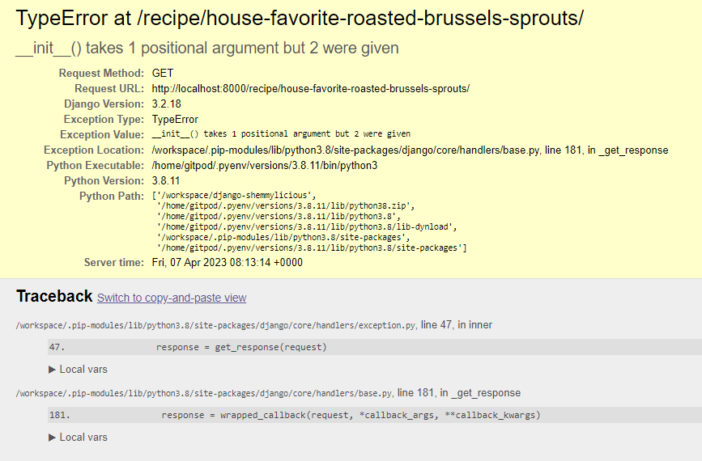

---

Heroku deloyment failed: JS (GSAP) animation in home screen started acting up as soon as I moved to production and deployed to Heroku.

    -----> Building on the Heroku-22 stack
    -----> Using buildpack: heroku/python
    -----> Python app detected
    -----> No Python version was specified. Using the same version as the last build: python-3.11.2
    To use a different version, see: https://devcenter.heroku.com/articles/python-runtimes
    !
    ! A Python security update is available! Upgrade as soon as possible to: python-3.11.3
    ! See: https://devcenter.heroku.com/articles/python-runtimes
    !
    -----> No change in requirements detected, installing from cache
    -----> Using cached install of python-3.11.2
    -----> Installing pip 23.1.2, setuptools 67.7.2 and wheel 0.40.0
    -----> Installing SQLite3
    -----> Installing requirements with pip
    -----> $ python manage.py collectstatic --noinput
    Traceback (most recent call last):
    File "/tmp/build_bfd91198/manage.py", line 22, in <module>
    main()
    File "/tmp/build_bfd91198/manage.py", line 18, in main
    execute_from_command_line(sys.argv)
    File "/app/.heroku/python/lib/python3.11/site-packages/django/core/management/__init__.py", line 419, in execute_from_command_line
    utility.execute()
    File "/app/.heroku/python/lib/python3.11/site-packages/django/core/management/__init__.py", line 413, in execute
    self.fetch_command(subcommand).run_from_argv(self.argv)
    File "/app/.heroku/python/lib/python3.11/site-packages/django/core/management/base.py", line 354, in run_from_argv
    self.execute(*args, **cmd_options)
    File "/app/.heroku/python/lib/python3.11/site-packages/django/core/management/base.py", line 398, in execute
    output = self.handle(*args, **options)
    ^^^^^^^^^^^^^^^^^^^^^^^^^^^^^
    File "/app/.heroku/python/lib/python3.11/site-packages/django/contrib/staticfiles/management/commands/collectstatic.py", line 187, in handle
    collected = self.collect()
    ^^^^^^^^^^^^^^
    File "/app/.heroku/python/lib/python3.11/site-packages/django/contrib/staticfiles/management/commands/collectstatic.py", line 114, in collect
    handler(path, prefixed_path, storage)
    File "/app/.heroku/python/lib/python3.11/site-packages/django/contrib/staticfiles/management/commands/collectstatic.py", line 348, in copy_file
    self.storage.save(prefixed_path, source_file)
    File "/app/.heroku/python/lib/python3.11/site-packages/django/core/files/storage.py", line 54, in save
    name = self._save(name, content)
    ^^^^^^^^^^^^^^^^^^^^^^^^^
    File "/app/.heroku/python/lib/python3.11/site-packages/cloudinary_storage/storage.py", line 252, in _save
    if not self._exists_with_etag(name, content):
    ^^^^^^^^^^^^^^^^^^^^^^^^^^^^^^^^^^^^^
    File "/app/.heroku/python/lib/python3.11/site-packages/cloudinary_storage/storage.py", line 241, in _exists_with_etag
    etag = response.headers["ETAG"].split('"')[1]
    ~~~~~~~~~~~~~~~~^^^^^^^^
    File "/app/.heroku/python/lib/python3.11/site-packages/requests/structures.py", line 52, in __getitem__
    return self._store[key.lower()][1]
    ~~~~~~~~~~~^^^^^^^^^^^^^
    KeyError: 'etag'
    ! Error while running '$ python manage.py collectstatic --noinput'.
    See traceback above for details.
    You may need to update application code to resolve this error.
    Or, you can disable collectstatic for this application:
    $ heroku config:set DISABLE_COLLECTSTATIC=1
    https://devcenter.heroku.com/articles/django-assets
    ! Push rejected, failed to compile Python app.
    ! Push failed

I have used a tutor seesion to resolve this issue:
the 'etag' error pops up sometimes when using cloudinary and can be a tricky one to troubleshoot as there doesn't seem to be a consistent solution. Can you try creating a copy of one of your static files, with a different name? You can just select the file here, and use Ctrl+C, then Ctrl+V - RESOLVED 

---

After DEBUG=FALSE and Heroku deployment, index page could not load.
I discovered that that I have typed in incorrect  url in the body of index.html - RESOLVED
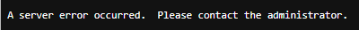

[Back to top &uarr;](#browser-compatibility)

***

# __Known Bugs__

GSAP Warnings

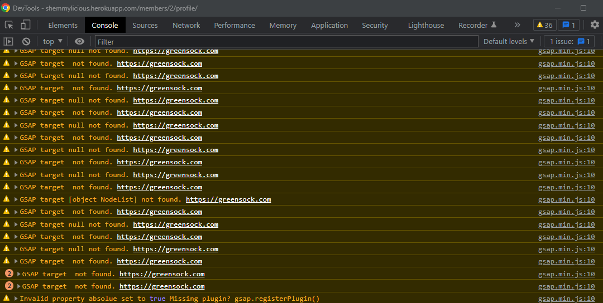

---

Profile Edit does not update username, first or last name or email address.

---

Password change does not update user password

[Back to top &uarr;](#browser-compatibility)

***
Back to [README.md](README.md) file.