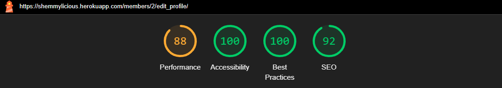

## Manual tests:

### __Welcome Screen__

 >>> Click for details

| Verification | Result |
| :----------------------------------------------------------: | :-------------: |
| Welcome screen has loaded correctly and as intended | Pass |
| Verified that the user can click sign-up button when not authenticated | Pass |
| Verified that the user can click login button when not authenticated | Pass |
| Verified that the user can click brows recipes button when authenticated | Pass |
| Verified that the user can click your recipes button when authenticated | Pass |
| Verified that the user can search recipe when authenticated | Pass |
| Verified that the user can scroll carousell pictures | Pass |
| Verified that the user can click each of footer links and all open on a new page | Pass |
| Verified that the user can click links in navbar and each link opens as intended | Pass |
| Verified that the user can click recipe link when authenticated | Pass |
| Verified that the user can click category link when authenticated | Pass |
| Verified that the user can click blog link when authenticated | Pass |
| Verified that the user can click user link when authenticated | Pass |
| Verified that the user can use a drop down link when authenticated | Pass |
| Verified that the user can choose user profile from user dropdown when authenticated | Pass |
| Verified that the user can choose user my recipe from user dropdown when authenticated | Pass |
| Verified that the user can choose user add recipe from user dropdown when authenticated | Pass |
| Verified that the user can logout from user profile dropdown when authenticated | Pass |
| Verified that the superuser can add category from user dropdown when authenticated | Pass |
| Verified that the superuser can go to django admin site from user dropdown when authenticated | Pass |

### __Recipes Screen__

 >>> Click for details

| Verification | Result |
| :----------------------------------------------------------: | :-------------: |
| Welcome screen has loaded correctly and as intended | Pass |
| Verified that the user can open recipes loaded when authenticated | Pass |
| Verified that the user can open author profile by clicking its name | Pass |
| Verified that the user can open category page by clicking category name | Pass |
| Verified that pagination is working as intended | Pass |

### __Recipe Details Screen__ (after clicking recipe title)

 >>> Click for details

| Verification | Result |
| :----------------------------------------------------------: | :-------------: |
| Recipes screen has loaded correctly and as intended  | Pass |
| Verified that the user can like or unlike recipe when authenticated | Pass |
| Verified that when the user likes/ulikes recipe a relevant message pops up  | Pass |
| Verified that the user can write a comment when authenticated | Pass |
| Verified that when the user writes a comment a relevant message pops up  | Pass |
| Verified that the back to blog & back to recipes buttons work as intended | Pass |

### __Category Screen__ 

 >>> Click for details

| Verification | Result |
| :----------------------------------------------------------: | :-------------: |
| Category screen has loaded correctly and as intended | Pass |
| Verified that the categories load randomly each time page is reloaded | Pass |
| Verified that the user can click category name to open a list of recipes in chosen category | Pass |
| Verified that the list of categoriesed recipes is loading correctly | Pass |
| Verified that if the category does not contain any recipes, correct message and buttons are shown  | Pass |
| Verified that when no recipes to be displayed in category view  add recipe buttons is shown  | Pass |
| Verified that the back to category & back to recipes buttons work as intended | Pass |

### __Blog Screen__ 

 >>> Click for details

| Verification | Result |
| :----------------------------------------------------------: | :-------------: |
| Blog screen has loaded correctly and as intended | Pass |
| Verified that the User can open Recipe view by clicking its title | Pass |
| Verified that the User can open Author profile page by clicking 'Author' tag | Pass |
| Verified that the User can open Category page by clicking 'Category' tag | Pass |
| Verified that the User can continue reading blog by clicking 'CONTINUE READING' link | Pass |
| Verified that pagination is working as intended | Pass |

### __Blog Details Screen__ (after clicking blog title)

 >>> Click for details

| Verification | Result |
| :----------------------------------------------------------: | :-------------: |
| Blog Detail screen has loaded correctly and as intended | Pass |
| Verified that Users comments are display correctly | Pass |
| Verified that the User pic/deatails display correctly | Pass |
| Verified that the User can like or unlike Recipe Post as intended | Pass |
| Verified that the User gets message that the after like/inlike is shown correctly | Pass |
| Verified that the User can comment Recipe Post as intended | Pass |
| Verified that the User gets message that the comment has been added and awaits Admin's verfication| Pass |
| Verified that the Superuser can delete comment from the list of comments as intended | Pass |
| Verified that the back to blog & back to recipes buttons work as intended | Pass |

### __Profile Screen__

 >>> Click for details

| Verification | Result |
| :----------------------------------------------------------: | :-------------: |
| My Profile screen has loaded correctly and as intended | Pass |
| Verified that 'Edit Bio & Social Links' button brings user to edit page | Pass |
| Verified that 'Edit Profile Settings' button brings user to edit page | Pass |
| Verified that 'Back to Your Recipes' button brings user to my recipes page | Pass |
| Verified that 'Back to Blog' button brings user to blog page | Pass |
| Verified that each social media links opens correctly | Pass |

### __Edit Bio & Social Links Screen__

 >>> Click for details

| Verification | Result |
| :----------------------------------------------------------: | :-------------: |
| Edit Bio & Social Links screen has loaded correctly and as intended | Pass |
| Verified that the User can update Bio | Pass |
| Verified that the User can update Profile pic | Pass |
| Verified that the User can update All Social Links | Pass |
| Verified that 'Back to Your Profile' button brings user to profile page | Pass |

### __Edit Profile Settings Screen__

 >>> Click for details

| Verification | Result |
| :----------------------------------------------------------: | :-------------: |
| Edit Profile Settings screen has loaded correctly and as intended | Pass |
|  | Pass |

### __Add Recipe Screen__ 

 >>> Click for details

| Verification | Result |
| :----------------------------------------------------------: | :-------------: |
| Add Recipe screen has loaded correctly and as intended | Pass |
| Verified that the User is presented with a form to be completed as intended | Pass |
| Verified that the 'Recipe' Title field is mandatory | Pass |
| Verified that the 'Category' field is mandatory | Pass |
| Verified that the 'Category' field is pulls data from Category model as intended | Pass |
| Verified that the 'Feature Comment' field is mandatory | Pass |
| Verified that the 'Recipe ingridients' & 'Recipe instructions' fields are shown as Summernote fields | Pass |
| Verified that the User can add additionl information in Excerpt field (not mandatory) | Pass |
| Verified that the User can add image which is saved in Cloudinary | Pass |
| Verified that the User is shown page and message on succesfull submittion | Pass |
| Verified that 'Back' button brings user to recipes page | Pass |

### __Add Category Screen__ (Superuser only)

 >>> Click for details

| Verification | Result |
| :----------------------------------------------------------: | :-------------: |
| Add Category screen has loaded correctly and as intended | Pass |
| Verified that the Superuser is presented with a form to be completed as intended | Pass |
| Verified that the 'Category Name' field is mandatory | Pass |
| Verified that the 'Category Comment' field is mandatory | Pass |
| Verified that the Superuser can add image which is saved in Cloudinary | Pass |
| Verified that the Superuser is redirected to Category page and is shown a message on succesfull submittion | Pass |
| Verified that 'Back' button brings user to recipes page | Pass |

### __Admin__ (Superuser only)

 >>> Click for details

| Verification | Result |
| :----------------------------------------------------------: | :-------------: |
| Super user can user a quick link from User manu to open Admin Panel | Pass |

***

# Browser Compatibility

After publishing to Heroku, the site was tested on Google Chrome, Microsoft Edge, Safari and Mozilla Firefox, with no visible issues for the user. 
The site has loaded correctly and had no issues across all browsers.

# __Validation__

## __HTML__

 >>> Click for Recipe validation img

 >>> Click for Add Recipe validation img

 >>> Click for Categories validation img

 >>> Click for My Recipes validation img

 >>> Click for Profile Edit validation img

 >>> Click XXX validation img

[Back to top &uarr;](#validation)
***
## __CSS__

 >>> Click for CSS validation img

[Back to top &uarr;](#validation)
***
## __JS__

 >>> Click for JSHint validation img

[Back to top &uarr;](#validation)
***
## __Lighthouse__

 >>> Click for Home Page Lighthouse Report

Desktop 

Mobile

***

 >>> Click for Recipe Page Lighthouse Report

Desktop 

Mobile

***

 >>> Click for Recipe Details Page Lighthouse Report

Desktop 

Mobile

***

 >>> Click for Category Page Lighthouse Report

Desktop 

Mobile

***

 >>> Click for Category List Page Lighthouse Report

Desktop 

Mobile

***

 >>> Click for Blog Page Lighthouse Report

Desktop 

Mobile

***

 >>> Click for Blog Details Lighthouse Report

Desktop 

Mobile

***

 >>> Click for Profile Page Lighthouse Report

Desktop 

Mobile

***

 >>> Click for Profile Bio Page Lighthouse Report

Desktop 

Mobile

***

 >>> Click for Profile Edit Page Lighthouse Report

Desktop 

Mobile

***

 >>> Click for Login Page Lighthouse Report

Desktop 

Mobile

***

## __PEP8 CI Validation__

***
app: __shemmylicious__

 >>> Click for urls.py validation img

[Back to top &uarr;](#validation)
***
app: __members__

 >>> Click for urls.py validation img

 >>> Click for views.py validation img

 >>> Click for forms.py validation img

[Back to top &uarr;](#validation)
***
app: __blog__

 >>> Click for urls.py validation img

 >>> Click for views.py validation img

 >>> Click for forms.py validation img

 >>> Click for models.py validation img

 >>> Click for admin.py validation img

[Back to top &uarr;](#validation)
***

    - [Manual tests](#manual-tests)
    - 
    - [Bugs](#bugs)
    - [Browser Compatibility](#browser-compatibility)

   
## Tests based on user stories

|     |                                   Story                     | Result |
| --- | :----------------------------------------------------------: | :-------------: |
| 1   |        | Yes             |

***

### __Bugs:__
#### __get_lines function__

***

#### __Known Bugs__

GSAP Warnings

***
Back to [README.md](README.md) file.